# 国密SSL标准交互过程说明

https://github.com/piligo/gmssldoc

## 前言

### 缘由

```
在fabric改造为国密的过程中时，深感国密ssl的相关的文档比较缺少，很多细节都不是很清晰。
因此，写此文档用于减少弯路。
目前国密的SSL标准，只有很少量的文档，文档里面有些并没有详细的解释清楚。
目前参考的标准文档连接为VPN的SSL库的标准。
这里结合TASSL的交互过程，对于整个的交互做一个详细的说明。同时留有数据可以做分析。
```

### 标准文档连接

GmSSL采用《GM/T 0024-2014: SSL VPN技术规范》的协议，即双证书模式。

```
中华人民共和国密码行业标准官网：http://www.gmbz.org.cn/main/bzlb.html 
```

### GMSSL说明

```
ssl/tls 目前国际标准的有tls1.1,tls1.2,tls1.3 而国密的SSL VPN技术规范的标准，是在tls1.1和tls1.2两者的一种结合。
加密相关的算法采用国标。交互的整体流程和标准类似。
国密的ssl使用的双证书方式：一个ca证书，一个加密en证书。
```


## SSL协议前置知识

### SSL/TLS协议栈


```
1、ssl/tls 是构建在TCP协议之上的。因此，主要的是理解tcp的封包解包格式和规范，以及交互的逻辑。
2、ssl/tls 所有的交互都是通过SSL记录协议的封装的。其实说白了就是 header+body形式 ，header里面固定的字段包含后面body的长度。
3、在body里面就是具体的握手协议，密码变更，报警协议，以及数据传输成。一层套一层的。
```


### SSL/TLS运作流程


### SSL和国密SSL有用的参考

```
https://blog.csdn.net/upset_ming/article/details/79880688 -->国密的详细报文格式
http://blog.fourthbit.com/2014/12/23/traffic-analysis-of-an-ssl-slash-tls-session/ -->SSL/TLS会话的流量分析
https://ruphi.cn/archives/381/
```


## GMSSL详细说明

### SSL记录协议

记录层协议是底层协议，所有的报文，包括握手协议、报警协议、密码规格变更协议等都要封装在记录层协议中进行传输。


### SSL记录协议Fragment里面的协议

1、报警协议（alert）

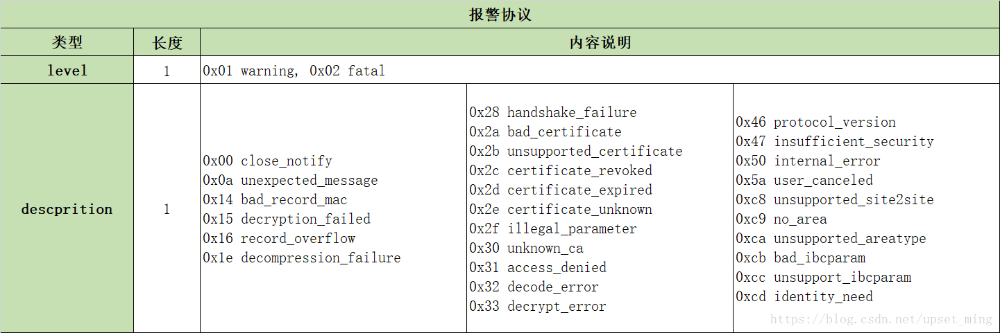

2、密码变更协议（change_cipher_spec）


3、握手协议（handshake）


4、握手协议交互过程：


4、应用数据传输协议(application_data)

```
0x17 application_data 的数据格式，直接和记录层协议一致。
记录层协议里面fragment的内容就是应用数据内容。（包含实际数据+mac校验位）
```

## GMSSL分析前数据准备

参考 《 TASSL环境准备.md 》获取数据如下：

### 服务端数据

```
Using default temp DH parameters
ACCEPT
<<< ??? [length 0005]
    16 01 01 00 64
<<< TLS 1.1 Handshake [length 0064], ClientHello
    01 00 00 60 01 01 40 3c c1 b0 0b aa b1 e6 e5 c0
    60 28 1a 2f 9f 2f 90 ed 75 0c 70 9c a1 f1 fd ea
    fd e6 24 7f ea 4d 00 00 04 e0 13 00 ff 01 00 00
    33 00 0b 00 04 03 00 01 02 00 0a 00 1e 00 1c 00
    1d 00 17 00 19 00 1c 00 1b 00 18 00 1a 00 16 00
    0e 00 0d 00 0b 00 0c 00 09 00 0a 00 23 00 00 00
    0f 00 01 01
>>> ??? [length 0005]
    16 01 01 00 42
>>> TLS 1.1 Handshake [length 0042], ServerHello
    02 00 00 3e 01 01 07 df f5 f4 a9 c8 98 f1 e8 3d
    e6 f1 b0 fd 57 22 e4 e7 7c ae 09 85 e5 68 27 59
    63 f9 bc 1f b7 32 00 e0 13 00 00 16 ff 01 00 01
    00 00 0b 00 04 03 00 01 02 00 23 00 00 00 0f 00
    01 01
>>> ??? [length 0005]
    16 01 01 06 a8
>>> TLS 1.1 Handshake [length 06a8], Certificate
    0b 00 06 a4 00 06 a1 00 02 1e 30 82 02 1a 30 82
    01 c1 a0 03 02 01 02 02 09 00 93 ec ed 1d b7 b5
    29 6d 30 0a 06 08 2a 81 1c cf 55 01 83 75 30 81
    82 31 0b 30 09 06 03 55 04 06 13 02 43 4e 31 0b
    30 09 06 03 55 04 08 0c 02 42 4a 31 10 30 0e 06
    03 55 04 07 0c 07 48 61 69 44 69 61 6e 31 25 30
    23 06 03 55 04 0a 0c 1c 42 65 69 6a 69 6e 67 20
    4a 4e 54 41 20 54 65 63 68 6e 6f 6c 6f 67 79 20
    4c 54 44 2e 31 15 30 13 06 03 55 04 0b 0c 0c 53
    4f 52 42 20 6f 66 20 54 41 53 53 31 16 30 14 06
    03 55 04 03 0c 0d 54 65 73 74 20 43 41 20 28 53
    4d 32 29 30 1e 17 0d 32 30 30 36 32 33 30 33 31
    30 34 36 5a 17 0d 32 34 30 38 30 31 30 33 31 30
    34 36 5a 30 81 86 31 0b 30 09 06 03 55 04 06 13
    02 43 4e 31 0b 30 09 06 03 55 04 08 0c 02 42 4a
    31 10 30 0e 06 03 55 04 07 0c 07 48 61 69 44 69
    61 6e 31 25 30 23 06 03 55 04 0a 0c 1c 42 65 69
    6a 69 6e 67 20 4a 4e 54 41 20 54 65 63 68 6e 6f
    6c 6f 67 79 20 4c 54 44 2e 31 15 30 13 06 03 55
    04 0b 0c 0c 42 53 52 43 20 6f 66 20 54 41 53 53
    31 1a 30 18 06 03 55 04 03 0c 11 73 65 72 76 65
    72 20 73 69 67 6e 20 28 53 4d 32 29 30 59 30 13
    06 07 2a 86 48 ce 3d 02 01 06 08 2a 81 1c cf 55
    01 82 2d 03 42 00 04 3a fd 53 33 58 4a 34 7f de
    39 ab 18 c5 1d 3b 13 70 20 02 4b 5d b1 25 22 8d
    86 74 8b 25 7f bb 73 ff ea 06 1f 0d 5f d4 ad 28
    e2 6d 29 2b 50 c0 d5 2d 93 c1 db 73 31 41 44 1a
    00 9c d1 0a d0 9a 7b a3 1a 30 18 30 09 06 03 55
    1d 13 04 02 30 00 30 0b 06 03 55 1d 0f 04 04 03
    02 06 c0 30 0a 06 08 2a 81 1c cf 55 01 83 75 03
    47 00 30 44 02 1f 49 b6 1b 3d 68 46 2b a2 d7 7c
    21 0d c3 41 33 ba 6d 85 8d 2e e8 43 ae 56 90 b5
    0f 43 d1 d2 85 02 21 00 f5 d1 b8 35 00 f8 b1 69
    46 e5 57 7f 98 89 1e 73 b0 ac 27 0f e8 ee da 85
    00 90 64 4c d4 30 fc 05 00 02 5d 30 82 02 59 30
    82 02 00 a0 03 02 01 02 02 09 00 ef 22 e3 6e 32
    51 c4 e9 30 0a 06 08 2a 81 1c cf 55 01 83 75 30
    81 82 31 0b 30 09 06 03 55 04 06 13 02 43 4e 31
    0b 30 09 06 03 55 04 08 0c 02 42 4a 31 10 30 0e
    06 03 55 04 07 0c 07 48 61 69 44 69 61 6e 31 25
    30 23 06 03 55 04 0a 0c 1c 42 65 69 6a 69 6e 67
    20 4a 4e 54 41 20 54 65 63 68 6e 6f 6c 6f 67 79
    20 4c 54 44 2e 31 15 30 13 06 03 55 04 0b 0c 0c
    53 4f 52 42 20 6f 66 20 54 41 53 53 31 16 30 14
    06 03 55 04 03 0c 0d 54 65 73 74 20 43 41 20 28
    53 4d 32 29 30 1e 17 0d 32 30 30 36 32 33 30 33
    31 30 34 36 5a 17 0d 32 34 30 38 30 31 30 33 31
    30 34 36 5a 30 81 82 31 0b 30 09 06 03 55 04 06
    13 02 43 4e 31 0b 30 09 06 03 55 04 08 0c 02 42
    4a 31 10 30 0e 06 03 55 04 07 0c 07 48 61 69 44
    69 61 6e 31 25 30 23 06 03 55 04 0a 0c 1c 42 65
    69 6a 69 6e 67 20 4a 4e 54 41 20 54 65 63 68 6e
    6f 6c 6f 67 79 20 4c 54 44 2e 31 15 30 13 06 03
    55 04 0b 0c 0c 53 4f 52 42 20 6f 66 20 54 41 53
    53 31 16 30 14 06 03 55 04 03 0c 0d 54 65 73 74
    20 43 41 20 28 53 4d 32 29 30 59 30 13 06 07 2a
    86 48 ce 3d 02 01 06 08 2a 81 1c cf 55 01 82 2d
    03 42 00 04 f1 db b0 f5 40 da 8c ba b8 01 0e d8
    28 af 66 28 8d f6 ae 81 4b 08 7f 97 30 15 6b 67
    cd 9d 90 82 fe 00 2f 76 72 e3 bb d1 1c ff 16 62
    47 f6 89 38 99 df a3 d9 f6 39 9d 7d 27 19 13 80
    ea 81 b2 89 a3 5d 30 5b 30 1d 06 03 55 1d 0e 04
    16 04 14 0e ea 3c 16 b9 49 c8 d8 96 99 47 46 2f
    f1 dd cc 2e 25 f8 ac 30 1f 06 03 55 1d 23 04 18
    30 16 80 14 0e ea 3c 16 b9 49 c8 d8 96 99 47 46
    2f f1 dd cc 2e 25 f8 ac 30 0c 06 03 55 1d 13 04
    05 30 03 01 01 ff 30 0b 06 03 55 1d 0f 04 04 03
    02 01 06 30 0a 06 08 2a 81 1c cf 55 01 83 75 03
    47 00 30 44 02 20 0c bf b0 b8 c3 93 4c 18 d9 04
    b4 bf 69 cf 21 a1 7c 5d 1c e1 f1 6b f7 e4 95 21
    98 2d b3 1c a0 72 02 20 74 d3 78 2f d3 3d 5b d7
    87 39 c0 31 ec 2d 1f 06 8b 2e 81 16 cc c1 c8 32
    d1 43 95 49 bf 7c 13 40 00 02 1d 30 82 02 19 30
    82 01 c0 a0 03 02 01 02 02 09 00 93 ec ed 1d b7
    b5 29 6e 30 0a 06 08 2a 81 1c cf 55 01 83 75 30
    81 82 31 0b 30 09 06 03 55 04 06 13 02 43 4e 31
    0b 30 09 06 03 55 04 08 0c 02 42 4a 31 10 30 0e
    06 03 55 04 07 0c 07 48 61 69 44 69 61 6e 31 25
    30 23 06 03 55 04 0a 0c 1c 42 65 69 6a 69 6e 67
    20 4a 4e 54 41 20 54 65 63 68 6e 6f 6c 6f 67 79
    20 4c 54 44 2e 31 15 30 13 06 03 55 04 0b 0c 0c
    53 4f 52 42 20 6f 66 20 54 41 53 53 31 16 30 14
    06 03 55 04 03 0c 0d 54 65 73 74 20 43 41 20 28
    53 4d 32 29 30 1e 17 0d 32 30 30 36 32 33 30 33
    31 30 34 36 5a 17 0d 32 34 30 38 30 31 30 33 31
    30 34 36 5a 30 81 85 31 0b 30 09 06 03 55 04 06
    13 02 43 4e 31 0b 30 09 06 03 55 04 08 0c 02 42
    4a 31 10 30 0e 06 03 55 04 07 0c 07 48 61 69 44
    69 61 6e 31 25 30 23 06 03 55 04 0a 0c 1c 42 65
    69 6a 69 6e 67 20 4a 4e 54 41 20 54 65 63 68 6e
    6f 6c 6f 67 79 20 4c 54 44 2e 31 15 30 13 06 03
    55 04 0b 0c 0c 42 53 52 43 20 6f 66 20 54 41 53
    53 31 19 30 17 06 03 55 04 03 0c 10 73 65 72 76
    65 72 20 65 6e 63 20 28 53 4d 32 29 30 59 30 13
    06 07 2a 86 48 ce 3d 02 01 06 08 2a 81 1c cf 55
    01 82 2d 03 42 00 04 d7 12 ff b5 d8 87 ae f6 8f
    a3 0a 80 8e c2 4c 9b a5 75 26 78 44 ce fe a2 84
    7a 22 2a 51 01 31 68 a3 ef 60 9d 87 0e 67 35 8a
    82 07 33 e2 8e 27 fd fa 3a e2 07 e8 c1 98 89 76
    49 7d 94 33 83 6c 50 a3 1a 30 18 30 09 06 03 55
    1d 13 04 02 30 00 30 0b 06 03 55 1d 0f 04 04 03
    02 03 38 30 0a 06 08 2a 81 1c cf 55 01 83 75 03
    47 00 30 44 02 20 73 95 a8 96 9b 16 34 91 8a 01
    1c f0 31 de 67 30 2b 6b d6 c7 92 90 b5 29 60 9a
    b6 85 dd 82 05 08 02 20 32 8c 1f f8 26 2c 74 6f
    46 1c bd f2 c2 b2 ff 10 8c 9e ba 90 70 d7 13 8d
    92 4c 8d d8 d1 5f 0a 47
>>> ??? [length 0005]
    16 01 01 00 4e
>>> TLS 1.1 Handshake [length 004e], ServerKeyExchange
    0c 00 00 4a 00 48 30 46 02 21 00 b0 4b 0a a7 23
    2a 35 43 49 a3 85 26 9e 09 63 0e f8 fd cb 79 39
    1d 2f f8 68 4c aa cd 0e 61 fd e7 02 21 00 a8 4c
    45 50 17 13 43 07 a7 08 44 b5 bf 73 ed 01 06 71
    bf fb 62 8f 9c 1b 2e 91 0a 71 f8 60 25 9c
>>> ??? [length 0005]
    16 01 01 00 04
>>> TLS 1.1 Handshake [length 0004], ServerHelloDone
    0e 00 00 00
<<< ??? [length 0005]
    16 01 01 00 a3
<<< TLS 1.1 Handshake [length 00a3], ClientKeyExchange
    10 00 00 9f 00 9d 30 81 9a 02 21 00 e8 32 de 8d
    e2 a1 87 4f bb fa ec c4 b7 31 56 a8 01 94 bf cd
    87 cd 36 95 5e 6b 72 18 da 9e bf 85 02 21 00 a4
    a2 60 2f 5f 69 5b 79 41 2d aa 8d 94 1b e4 2b 61
    57 a9 17 be 2d 79 59 fd ae d1 4f 2d 5b 5b 1d 04
    20 8f 82 60 1a 67 c5 85 46 86 ed 45 d9 51 8a 3f
    3e d5 f5 fa ee 65 84 ff 9d 89 68 ff c0 c0 cf 85
    3c 04 30 20 0c 35 f0 fe 14 fc 0e a1 b6 56 c5 31
    7a 5b 7b 60 bb c1 39 a4 26 95 50 ad 5f 82 6e d2
    f1 2c fd 54 32 22 29 1c ee 75 a6 37 b0 d5 10 cc
    e7 2e f6
<<< ??? [length 0005]
    14 01 01 00 01
<<< TLS 1.1 ChangeCipherSpec [length 0001]
    01
<<< ??? [length 0005]
    16 01 01 00 50
<<< TLS 1.1 Handshake [length 0010], Finished
    14 00 00 0c 1a 77 09 fc 45 d8 9f 5b 1c 8e 53 ab
>>> ??? [length 0005]
    16 01 01 00 aa
>>> TLS 1.1 Handshake [length 00aa]???
    04 00 00 a6 00 00 01 2c 00 a0 2c f0 bd bb e2 d0
    56 7c 2c e2 f7 55 f1 d0 75 4c 71 7e 2a be 9a 60
    07 51 84 7f 7b 92 43 73 41 2f f0 e8 65 43 55 c1
    f2 fb 1b ad b2 8d 13 c5 a9 2f 16 61 45 0e 77 bb
    bf 68 b3 60 16 4b 23 a9 a9 0e 60 26 3c da 87 de
    df c2 43 f6 f6 8d e0 e6 a2 f9 13 d0 0f 1b 65 8f
    73 3f 5f 03 e1 c5 53 51 10 2c 7f 8f a5 a2 8f 44
    28 bd aa aa 46 f5 54 b2 1c 19 9c df 79 98 e8 08
    fb 14 97 45 9d bc 97 9f 5e 2a a5 e6 77 09 a3 d4
    6e 31 63 8f a0 f6 aa 64 42 50 6e be 40 a3 8b ae
    4c b5 1f e3 b9 34 f6 23 b7 a6
>>> ??? [length 0005]
    14 01 01 00 01
>>> TLS 1.1 ChangeCipherSpec [length 0001]
    01
>>> ??? [length 0005]
    16 01 01 00 50
>>> TLS 1.1 Handshake [length 0010], Finished
    14 00 00 0c b7 aa ba 4f 95 3b b2 6d 5b 07 0d 52
-----BEGIN SSL SESSION PARAMETERS-----
MFUCAQECAgMCBALgEwQABDDA/V/GaVmQ0jiS1WWQq3z6m2kspqJ8gBxC2Fuil2Zq
3qkyEThcPpwwuaMOTIu6ZsOhBgIEXvF0SKIEAgIBLKQGBAQBAAAA
-----END SSL SESSION PARAMETERS-----
Shared ciphers:ECC-SM4-SM3
Supported Elliptic Curve Point Formats: uncompressed:ansiX962_compressed_prime:ansiX962_compressed_char2
Supported Elliptic Curves: SM2:P-256:P-521:brainpoolP512r1:brainpoolP384r1:P-384:brainpoolP256r1:secp256k1:B-571:K-571:K-409:B-409:K-283:B-283
Shared Elliptic curves: SM2:P-256:P-521:brainpoolP512r1:brainpoolP384r1:P-384:brainpoolP256r1:secp256k1:B-571:K-571:K-409:B-409:K-283:B-283
CIPHER is ECC-SM4-SM3
Secure Renegotiation IS supported
```

### 客户端数据

```
>>> ??? [length 0005]
    16 01 01 00 64
>>> TLS 1.1 Handshake [length 0064], ClientHello
    01 00 00 60 01 01 40 3c c1 b0 0b aa b1 e6 e5 c0
    60 28 1a 2f 9f 2f 90 ed 75 0c 70 9c a1 f1 fd ea
    fd e6 24 7f ea 4d 00 00 04 e0 13 00 ff 01 00 00
    33 00 0b 00 04 03 00 01 02 00 0a 00 1e 00 1c 00
    1d 00 17 00 19 00 1c 00 1b 00 18 00 1a 00 16 00
    0e 00 0d 00 0b 00 0c 00 09 00 0a 00 23 00 00 00
    0f 00 01 01
<<< ??? [length 0005]
    16 01 01 00 42
<<< TLS 1.1 Handshake [length 0042], ServerHello
    02 00 00 3e 01 01 07 df f5 f4 a9 c8 98 f1 e8 3d
    e6 f1 b0 fd 57 22 e4 e7 7c ae 09 85 e5 68 27 59
    63 f9 bc 1f b7 32 00 e0 13 00 00 16 ff 01 00 01
    00 00 0b 00 04 03 00 01 02 00 23 00 00 00 0f 00
    01 01
<<< ??? [length 0005]
    16 01 01 06 a8
<<< TLS 1.1 Handshake [length 06a8], Certificate
    0b 00 06 a4 00 06 a1 00 02 1e 30 82 02 1a 30 82
    01 c1 a0 03 02 01 02 02 09 00 93 ec ed 1d b7 b5
    29 6d 30 0a 06 08 2a 81 1c cf 55 01 83 75 30 81
    82 31 0b 30 09 06 03 55 04 06 13 02 43 4e 31 0b
    30 09 06 03 55 04 08 0c 02 42 4a 31 10 30 0e 06
    03 55 04 07 0c 07 48 61 69 44 69 61 6e 31 25 30
    23 06 03 55 04 0a 0c 1c 42 65 69 6a 69 6e 67 20
    4a 4e 54 41 20 54 65 63 68 6e 6f 6c 6f 67 79 20
    4c 54 44 2e 31 15 30 13 06 03 55 04 0b 0c 0c 53
    4f 52 42 20 6f 66 20 54 41 53 53 31 16 30 14 06
    03 55 04 03 0c 0d 54 65 73 74 20 43 41 20 28 53
    4d 32 29 30 1e 17 0d 32 30 30 36 32 33 30 33 31
    30 34 36 5a 17 0d 32 34 30 38 30 31 30 33 31 30
    34 36 5a 30 81 86 31 0b 30 09 06 03 55 04 06 13
    02 43 4e 31 0b 30 09 06 03 55 04 08 0c 02 42 4a
    31 10 30 0e 06 03 55 04 07 0c 07 48 61 69 44 69
    61 6e 31 25 30 23 06 03 55 04 0a 0c 1c 42 65 69
    6a 69 6e 67 20 4a 4e 54 41 20 54 65 63 68 6e 6f
    6c 6f 67 79 20 4c 54 44 2e 31 15 30 13 06 03 55
    04 0b 0c 0c 42 53 52 43 20 6f 66 20 54 41 53 53
    31 1a 30 18 06 03 55 04 03 0c 11 73 65 72 76 65
    72 20 73 69 67 6e 20 28 53 4d 32 29 30 59 30 13
    06 07 2a 86 48 ce 3d 02 01 06 08 2a 81 1c cf 55
    01 82 2d 03 42 00 04 3a fd 53 33 58 4a 34 7f de
    39 ab 18 c5 1d 3b 13 70 20 02 4b 5d b1 25 22 8d
    86 74 8b 25 7f bb 73 ff ea 06 1f 0d 5f d4 ad 28
    e2 6d 29 2b 50 c0 d5 2d 93 c1 db 73 31 41 44 1a
    00 9c d1 0a d0 9a 7b a3 1a 30 18 30 09 06 03 55
    1d 13 04 02 30 00 30 0b 06 03 55 1d 0f 04 04 03
    02 06 c0 30 0a 06 08 2a 81 1c cf 55 01 83 75 03
    47 00 30 44 02 1f 49 b6 1b 3d 68 46 2b a2 d7 7c
    21 0d c3 41 33 ba 6d 85 8d 2e e8 43 ae 56 90 b5
    0f 43 d1 d2 85 02 21 00 f5 d1 b8 35 00 f8 b1 69
    46 e5 57 7f 98 89 1e 73 b0 ac 27 0f e8 ee da 85
    00 90 64 4c d4 30 fc 05 00 02 5d 30 82 02 59 30
    82 02 00 a0 03 02 01 02 02 09 00 ef 22 e3 6e 32
    51 c4 e9 30 0a 06 08 2a 81 1c cf 55 01 83 75 30
    81 82 31 0b 30 09 06 03 55 04 06 13 02 43 4e 31
    0b 30 09 06 03 55 04 08 0c 02 42 4a 31 10 30 0e
    06 03 55 04 07 0c 07 48 61 69 44 69 61 6e 31 25
    30 23 06 03 55 04 0a 0c 1c 42 65 69 6a 69 6e 67
    20 4a 4e 54 41 20 54 65 63 68 6e 6f 6c 6f 67 79
    20 4c 54 44 2e 31 15 30 13 06 03 55 04 0b 0c 0c
    53 4f 52 42 20 6f 66 20 54 41 53 53 31 16 30 14
    06 03 55 04 03 0c 0d 54 65 73 74 20 43 41 20 28
    53 4d 32 29 30 1e 17 0d 32 30 30 36 32 33 30 33
    31 30 34 36 5a 17 0d 32 34 30 38 30 31 30 33 31
    30 34 36 5a 30 81 82 31 0b 30 09 06 03 55 04 06
    13 02 43 4e 31 0b 30 09 06 03 55 04 08 0c 02 42
    4a 31 10 30 0e 06 03 55 04 07 0c 07 48 61 69 44
    69 61 6e 31 25 30 23 06 03 55 04 0a 0c 1c 42 65
    69 6a 69 6e 67 20 4a 4e 54 41 20 54 65 63 68 6e
    6f 6c 6f 67 79 20 4c 54 44 2e 31 15 30 13 06 03
    55 04 0b 0c 0c 53 4f 52 42 20 6f 66 20 54 41 53
    53 31 16 30 14 06 03 55 04 03 0c 0d 54 65 73 74
    20 43 41 20 28 53 4d 32 29 30 59 30 13 06 07 2a
    86 48 ce 3d 02 01 06 08 2a 81 1c cf 55 01 82 2d
    03 42 00 04 f1 db b0 f5 40 da 8c ba b8 01 0e d8
    28 af 66 28 8d f6 ae 81 4b 08 7f 97 30 15 6b 67
    cd 9d 90 82 fe 00 2f 76 72 e3 bb d1 1c ff 16 62
    47 f6 89 38 99 df a3 d9 f6 39 9d 7d 27 19 13 80
    ea 81 b2 89 a3 5d 30 5b 30 1d 06 03 55 1d 0e 04
    16 04 14 0e ea 3c 16 b9 49 c8 d8 96 99 47 46 2f
    f1 dd cc 2e 25 f8 ac 30 1f 06 03 55 1d 23 04 18
    30 16 80 14 0e ea 3c 16 b9 49 c8 d8 96 99 47 46
    2f f1 dd cc 2e 25 f8 ac 30 0c 06 03 55 1d 13 04
    05 30 03 01 01 ff 30 0b 06 03 55 1d 0f 04 04 03
    02 01 06 30 0a 06 08 2a 81 1c cf 55 01 83 75 03
    47 00 30 44 02 20 0c bf b0 b8 c3 93 4c 18 d9 04
    b4 bf 69 cf 21 a1 7c 5d 1c e1 f1 6b f7 e4 95 21
    98 2d b3 1c a0 72 02 20 74 d3 78 2f d3 3d 5b d7
    87 39 c0 31 ec 2d 1f 06 8b 2e 81 16 cc c1 c8 32
    d1 43 95 49 bf 7c 13 40 00 02 1d 30 82 02 19 30
    82 01 c0 a0 03 02 01 02 02 09 00 93 ec ed 1d b7
    b5 29 6e 30 0a 06 08 2a 81 1c cf 55 01 83 75 30
    81 82 31 0b 30 09 06 03 55 04 06 13 02 43 4e 31
    0b 30 09 06 03 55 04 08 0c 02 42 4a 31 10 30 0e
    06 03 55 04 07 0c 07 48 61 69 44 69 61 6e 31 25
    30 23 06 03 55 04 0a 0c 1c 42 65 69 6a 69 6e 67
    20 4a 4e 54 41 20 54 65 63 68 6e 6f 6c 6f 67 79
    20 4c 54 44 2e 31 15 30 13 06 03 55 04 0b 0c 0c
    53 4f 52 42 20 6f 66 20 54 41 53 53 31 16 30 14
    06 03 55 04 03 0c 0d 54 65 73 74 20 43 41 20 28
    53 4d 32 29 30 1e 17 0d 32 30 30 36 32 33 30 33
    31 30 34 36 5a 17 0d 32 34 30 38 30 31 30 33 31
    30 34 36 5a 30 81 85 31 0b 30 09 06 03 55 04 06
    13 02 43 4e 31 0b 30 09 06 03 55 04 08 0c 02 42
    4a 31 10 30 0e 06 03 55 04 07 0c 07 48 61 69 44
    69 61 6e 31 25 30 23 06 03 55 04 0a 0c 1c 42 65
    69 6a 69 6e 67 20 4a 4e 54 41 20 54 65 63 68 6e
    6f 6c 6f 67 79 20 4c 54 44 2e 31 15 30 13 06 03
    55 04 0b 0c 0c 42 53 52 43 20 6f 66 20 54 41 53
    53 31 19 30 17 06 03 55 04 03 0c 10 73 65 72 76
    65 72 20 65 6e 63 20 28 53 4d 32 29 30 59 30 13
    06 07 2a 86 48 ce 3d 02 01 06 08 2a 81 1c cf 55
    01 82 2d 03 42 00 04 d7 12 ff b5 d8 87 ae f6 8f
    a3 0a 80 8e c2 4c 9b a5 75 26 78 44 ce fe a2 84
    7a 22 2a 51 01 31 68 a3 ef 60 9d 87 0e 67 35 8a
    82 07 33 e2 8e 27 fd fa 3a e2 07 e8 c1 98 89 76
    49 7d 94 33 83 6c 50 a3 1a 30 18 30 09 06 03 55
    1d 13 04 02 30 00 30 0b 06 03 55 1d 0f 04 04 03
    02 03 38 30 0a 06 08 2a 81 1c cf 55 01 83 75 03
    47 00 30 44 02 20 73 95 a8 96 9b 16 34 91 8a 01
    1c f0 31 de 67 30 2b 6b d6 c7 92 90 b5 29 60 9a
    b6 85 dd 82 05 08 02 20 32 8c 1f f8 26 2c 74 6f
    46 1c bd f2 c2 b2 ff 10 8c 9e ba 90 70 d7 13 8d
    92 4c 8d d8 d1 5f 0a 47
depth=1 C = CN, ST = BJ, L = HaiDian, O = Beijing JNTA Technology LTD., OU = SORB of TASS, CN = Test CA (SM2)
verify error:num=19:self signed certificate in certificate chain
<<< ??? [length 0005]
    16 01 01 00 4e
<<< TLS 1.1 Handshake [length 004e], ServerKeyExchange
    0c 00 00 4a 00 48 30 46 02 21 00 b0 4b 0a a7 23
    2a 35 43 49 a3 85 26 9e 09 63 0e f8 fd cb 79 39
    1d 2f f8 68 4c aa cd 0e 61 fd e7 02 21 00 a8 4c
    45 50 17 13 43 07 a7 08 44 b5 bf 73 ed 01 06 71
    bf fb 62 8f 9c 1b 2e 91 0a 71 f8 60 25 9c
<<< ??? [length 0005]
    16 01 01 00 04
<<< TLS 1.1 Handshake [length 0004], ServerHelloDone
    0e 00 00 00
>>> ??? [length 0005]
    16 01 01 00 a3
>>> TLS 1.1 Handshake [length 00a3], ClientKeyExchange
    10 00 00 9f 00 9d 30 81 9a 02 21 00 e8 32 de 8d
    e2 a1 87 4f bb fa ec c4 b7 31 56 a8 01 94 bf cd
    87 cd 36 95 5e 6b 72 18 da 9e bf 85 02 21 00 a4
    a2 60 2f 5f 69 5b 79 41 2d aa 8d 94 1b e4 2b 61
    57 a9 17 be 2d 79 59 fd ae d1 4f 2d 5b 5b 1d 04
    20 8f 82 60 1a 67 c5 85 46 86 ed 45 d9 51 8a 3f
    3e d5 f5 fa ee 65 84 ff 9d 89 68 ff c0 c0 cf 85
    3c 04 30 20 0c 35 f0 fe 14 fc 0e a1 b6 56 c5 31
    7a 5b 7b 60 bb c1 39 a4 26 95 50 ad 5f 82 6e d2
    f1 2c fd 54 32 22 29 1c ee 75 a6 37 b0 d5 10 cc
    e7 2e f6
>>> ??? [length 0005]
    14 01 01 00 01
>>> TLS 1.1 ChangeCipherSpec [length 0001]
    01
>>> ??? [length 0005]
    16 01 01 00 50
>>> TLS 1.1 Handshake [length 0010], Finished
    14 00 00 0c 1a 77 09 fc 45 d8 9f 5b 1c 8e 53 ab
<<< ??? [length 0005]
    16 01 01 00 aa
<<< TLS 1.1 Handshake [length 00aa]???
    04 00 00 a6 00 00 01 2c 00 a0 2c f0 bd bb e2 d0
    56 7c 2c e2 f7 55 f1 d0 75 4c 71 7e 2a be 9a 60
    07 51 84 7f 7b 92 43 73 41 2f f0 e8 65 43 55 c1
    f2 fb 1b ad b2 8d 13 c5 a9 2f 16 61 45 0e 77 bb
    bf 68 b3 60 16 4b 23 a9 a9 0e 60 26 3c da 87 de
    df c2 43 f6 f6 8d e0 e6 a2 f9 13 d0 0f 1b 65 8f
    73 3f 5f 03 e1 c5 53 51 10 2c 7f 8f a5 a2 8f 44
    28 bd aa aa 46 f5 54 b2 1c 19 9c df 79 98 e8 08
    fb 14 97 45 9d bc 97 9f 5e 2a a5 e6 77 09 a3 d4
    6e 31 63 8f a0 f6 aa 64 42 50 6e be 40 a3 8b ae
    4c b5 1f e3 b9 34 f6 23 b7 a6
<<< ??? [length 0005]
    14 01 01 00 01
<<< TLS 1.1 ChangeCipherSpec [length 0001]
    01
<<< ??? [length 0005]
    16 01 01 00 50
<<< TLS 1.1 Handshake [length 0010], Finished
    14 00 00 0c b7 aa ba 4f 95 3b b2 6d 5b 07 0d 52
---
Certificate chain
 0 s:/C=CN/ST=BJ/L=HaiDian/O=Beijing JNTA Technology LTD./OU=BSRC of TASS/CN=server sign (SM2)
   i:/C=CN/ST=BJ/L=HaiDian/O=Beijing JNTA Technology LTD./OU=SORB of TASS/CN=Test CA (SM2)
 1 s:/C=CN/ST=BJ/L=HaiDian/O=Beijing JNTA Technology LTD./OU=SORB of TASS/CN=Test CA (SM2)
   i:/C=CN/ST=BJ/L=HaiDian/O=Beijing JNTA Technology LTD./OU=SORB of TASS/CN=Test CA (SM2)
 2 s:/C=CN/ST=BJ/L=HaiDian/O=Beijing JNTA Technology LTD./OU=BSRC of TASS/CN=server enc (SM2)
   i:/C=CN/ST=BJ/L=HaiDian/O=Beijing JNTA Technology LTD./OU=SORB of TASS/CN=Test CA (SM2)
---
Server certificate
-----BEGIN CERTIFICATE-----
MIICGjCCAcGgAwIBAgIJAJPs7R23tSltMAoGCCqBHM9VAYN1MIGCMQswCQYDVQQG
EwJDTjELMAkGA1UECAwCQkoxEDAOBgNVBAcMB0hhaURpYW4xJTAjBgNVBAoMHEJl
aWppbmcgSk5UQSBUZWNobm9sb2d5IExURC4xFTATBgNVBAsMDFNPUkIgb2YgVEFT
UzEWMBQGA1UEAwwNVGVzdCBDQSAoU00yKTAeFw0yMDA2MjMwMzEwNDZaFw0yNDA4
MDEwMzEwNDZaMIGGMQswCQYDVQQGEwJDTjELMAkGA1UECAwCQkoxEDAOBgNVBAcM
B0hhaURpYW4xJTAjBgNVBAoMHEJlaWppbmcgSk5UQSBUZWNobm9sb2d5IExURC4x
FTATBgNVBAsMDEJTUkMgb2YgVEFTUzEaMBgGA1UEAwwRc2VydmVyIHNpZ24gKFNN
MikwWTATBgcqhkjOPQIBBggqgRzPVQGCLQNCAAQ6/VMzWEo0f945qxjFHTsTcCAC
S12xJSKNhnSLJX+7c//qBh8NX9StKOJtKStQwNUtk8HbczFBRBoAnNEK0Jp7oxow
GDAJBgNVHRMEAjAAMAsGA1UdDwQEAwIGwDAKBggqgRzPVQGDdQNHADBEAh9Jths9
aEYrotd8IQ3DQTO6bYWNLuhDrlaQtQ9D0dKFAiEA9dG4NQD4sWlG5Vd/mIkec7Cs
Jw/o7tqFAJBkTNQw/AU=
-----END CERTIFICATE-----
subject=/C=CN/ST=BJ/L=HaiDian/O=Beijing JNTA Technology LTD./OU=BSRC of TASS/CN=server sign (SM2)
issuer=/C=CN/ST=BJ/L=HaiDian/O=Beijing JNTA Technology LTD./OU=SORB of TASS/CN=Test CA (SM2)
---
No client certificate CA names sent
---
SSL handshake has read 2138 bytes and written 364 bytes
---
New, TLSv1/SSLv3, Cipher is ECC-SM4-SM3
Server public key is 256 bit
Secure Renegotiation IS supported
Compression: NONE
Expansion: NONE
No ALPN negotiated
SSL-Session:
    Protocol  : TLSv1.1
    Cipher    : ECC-SM4-SM3
    Session-ID: 8673AA9B4BC8C43A73DAF4BA86705A2904224C4A0035E1773EBB0716ADD37423
    Session-ID-ctx:
    Master-Key: C0FD5FC6695990D23892D56590AB7CFA9B692CA6A27C801C42D85BA297666ADEA93211385C3E9C30B9A30E4C8BBA66C3
    Key-Arg   : None
    PSK identity: None
    PSK identity hint: None
    SRP username: None
    TLS session ticket lifetime hint: 300 (seconds)
    TLS session ticket:
    0000 - 2c f0 bd bb e2 d0 56 7c-2c e2 f7 55 f1 d0 75 4c   ,.....V|,..U..uL
    0010 - 71 7e 2a be 9a 60 07 51-84 7f 7b 92 43 73 41 2f   q~*..`.Q..{.CsA/
    0020 - f0 e8 65 43 55 c1 f2 fb-1b ad b2 8d 13 c5 a9 2f   ..eCU........../
    0030 - 16 61 45 0e 77 bb bf 68-b3 60 16 4b 23 a9 a9 0e   .aE.w..h.`.K#...
    0040 - 60 26 3c da 87 de df c2-43 f6 f6 8d e0 e6 a2 f9   `&<.....C.......
    0050 - 13 d0 0f 1b 65 8f 73 3f-5f 03 e1 c5 53 51 10 2c   ....e.s?_...SQ.,
    0060 - 7f 8f a5 a2 8f 44 28 bd-aa aa 46 f5 54 b2 1c 19   .....D(...F.T...
    0070 - 9c df 79 98 e8 08 fb 14-97 45 9d bc 97 9f 5e 2a   ..y......E....^*
    0080 - a5 e6 77 09 a3 d4 6e 31-63 8f a0 f6 aa 64 42 50   ..w...n1c....dBP
    0090 - 6e be 40 a3 8b ae 4c b5-1f e3 b9 34 f6 23 b7 a6   n.@...L....4.#..

    Start Time: 1592882248
    Timeout   : 7200 (sec)
    Verify return code: 19 (self signed certificate in certificate chain)
---
```

### 证书文件（sm2Certs）

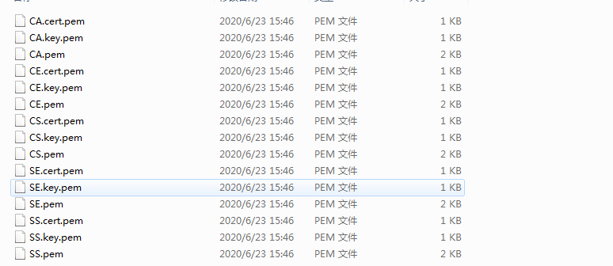

## 流量分析

### 说明

```
1、主要以服务端采集到的数据为分析基础。客户端的数据日志做辅助（主要是为了对比masterkey的计算的正确性）
2、协议的主要难点在于握手协议，因此主要分析握手协议。
3、服务端采集的日志 以<<< ??? [length 0005] 表示接受到一个记录协议包  ，>>> ??? [length 0005] 表示响应给客户端的记录协议包。
```

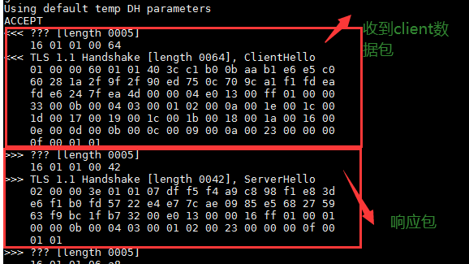

备注：只对第一个ClientHello 做一下记录层的协议的包说明，其他因形式类似，自做具体协议分析。不在对记录层协议做说明。

### ClientHello（客户端请求）

1、数据包：

```
<<< ??? [length 0005]
    16 01 01 00 64
<<< TLS 1.1 Handshake [length 0064], ClientHello
    01 00 00 60 01 01 40 3c c1 b0 0b aa b1 e6 e5 c0
    60 28 1a 2f 9f 2f 90 ed 75 0c 70 9c a1 f1 fd ea
    fd e6 24 7f ea 4d 00 00 04 e0 13 00 ff 01 00 00
    33 00 0b 00 04 03 00 01 02 00 0a 00 1e 00 1c 00
    1d 00 17 00 19 00 1c 00 1b 00 18 00 1a 00 16 00
    0e 00 0d 00 0b 00 0c 00 09 00 0a 00 23 00 00 00
    0f 00 01 01
```

2、分析说明


记录层协议

```
16 01 01 00 64 -->> 记录层协议：0x16 （握手协议）, 0x0101 （版本号码1.1） ，0x0064(fragment长度[数后面的数据 6*16+4==0x64])
```

ClientHello协议

```
01 -->clientHello协议标识
00 00 60  -->后面body总长度
01 01  -->版本号1.1
40 3c c1 b0 0b aa b1 e6 e5 c0 60 28 1a 2f 9f 2f \
90 ed 75 0c 70 9c a1 f1 fd ea fd e6 24 7f ea 4d --->32个字节的随机数（4字节unix时间+28个字节随机数）
00 -->session_id_len 为0
00 04 e0 13 00 ff -->00 04(密码套件长度)  e0 13(密码套件ECC-SM3-SM4) 00 ff(密码套件2这是默认结束符)
01 00 -->01 压缩算法长度 00 压缩算法标识
00 33 -->00 33 扩展字段的总长度（后续51个字节）[扩展字段格式：扩展类型（2字节）+扩展字段长度（2字节）+扩展字段内容]
00 0b 00 04 03 00 01 02 --> 00 0b(扩展字段类型) 00 04（长度，后面4字节） 03 00 01 02（内容）
00 0a 00 1e -->00 0a(扩展字段类型) 00 1e（长度，后面30字节）
00 1c 00 1d 00 17 00 19 00 1c 00 1b 00 18 00 1a 
00 16 00 0e 00 0d 00 0b 00 0c 00 09 00 0a  -->30个字节扩展内容
00 23 00 00 -->00 23(扩展字段类型) 00 00 (长度 为0)
00 0f 00 01 01 -->00 0f(扩展字段类型) 00 01 (长度 为1个字节) 01（扩展字段内容）
```

备注：重要的字段

```
1、32个字节的随机数（用于密钥的产生和计算）：403cc1b00baab1e6e5c060281a2f9f2f90ed750c709ca1f1fdeafde6247fea4d
2、密码套件的0xE013(ECC-SM3-SM4) 
```

### ServerHello（服务端响应）


1、数据包

```
>>> TLS 1.1 Handshake [length 0042], ServerHello
    02 00 00 3e 01 01 07 df f5 f4 a9 c8 98 f1 e8 3d
    e6 f1 b0 fd 57 22 e4 e7 7c ae 09 85 e5 68 27 59
    63 f9 bc 1f b7 32 00 e0 13 00 00 16 ff 01 00 01
    00 00 0b 00 04 03 00 01 02 00 23 00 00 00 0f 00
    01 01
```

2、serverHello协议内容

```
02  -->serverHello类型
00 00 3e -->body的总的长度
01 01  -->国密版本号：1.1
07 df f5 f4 a9 c8 98 f1 e8 3d e6 f1 b0 fd 57 22 \
e4 e7 7c ae 09 85 e5 68 27 59 63 f9 bc 1f b7 32 ---> 32个字节的随机数（4字节时间+28字节随机数）
00 -->session id len 为 0
e0 13 -->选定的密码套件 ECC-SM3-SM4
00 00 16  -->后续扩展字段的总长度
ff 01 00 01 00 --> ff 01(扩展字段类型) 00 01（扩展字段长度1个字节） 00（扩展字段值）
00 0b 00 04 03 00 01 02 -->00 0b(扩展字段类型) 00 04（扩展字段长度4个字节） 03 00 01 02（扩展字段值）
00 23 00 00 --> 00 23(扩展字段类型)  00 00（扩展字段长度0个字节）
00 0f 00 01 01 -->00 0f (扩展字段类型) 00 01（扩展字段长度1个字节） 01（扩展字段值）
```

备注重要字段：

```
1、32个字节的随机数：
07dff5f4a9c898f1e83de6f1b0fd5722e4e77cae0985e568275963f9bc1fb732
2、e0 13 -->选定的密码套件为 ECC-SM3-SM4
```

### Certificate（服务端响应）


1、数据包：

```
>>> ??? [length 0005]
    16 01 01 06 a8
>>> TLS 1.1 Handshake [length 06a8], Certificate
    0b 00 06 a4 00 06 a1 00 02 1e 30 82 02 1a 30 82
    01 c1 a0 03 02 01 02 02 09 00 93 ec ed 1d b7 b5
    29 6d 30 0a 06 08 2a 81 1c cf 55 01 83 75 30 81
    82 31 0b 30 09 06 03 55 04 06 13 02 43 4e 31 0b
    30 09 06 03 55 04 08 0c 02 42 4a 31 10 30 0e 06
    03 55 04 07 0c 07 48 61 69 44 69 61 6e 31 25 30
    23 06 03 55 04 0a 0c 1c 42 65 69 6a 69 6e 67 20
    4a 4e 54 41 20 54 65 63 68 6e 6f 6c 6f 67 79 20
    4c 54 44 2e 31 15 30 13 06 03 55 04 0b 0c 0c 53
    4f 52 42 20 6f 66 20 54 41 53 53 31 16 30 14 06
    03 55 04 03 0c 0d 54 65 73 74 20 43 41 20 28 53
    4d 32 29 30 1e 17 0d 32 30 30 36 32 33 30 33 31
    30 34 36 5a 17 0d 32 34 30 38 30 31 30 33 31 30
    34 36 5a 30 81 86 31 0b 30 09 06 03 55 04 06 13
    02 43 4e 31 0b 30 09 06 03 55 04 08 0c 02 42 4a
    31 10 30 0e 06 03 55 04 07 0c 07 48 61 69 44 69
    61 6e 31 25 30 23 06 03 55 04 0a 0c 1c 42 65 69
    6a 69 6e 67 20 4a 4e 54 41 20 54 65 63 68 6e 6f
    6c 6f 67 79 20 4c 54 44 2e 31 15 30 13 06 03 55
    04 0b 0c 0c 42 53 52 43 20 6f 66 20 54 41 53 53
    31 1a 30 18 06 03 55 04 03 0c 11 73 65 72 76 65
    72 20 73 69 67 6e 20 28 53 4d 32 29 30 59 30 13
    06 07 2a 86 48 ce 3d 02 01 06 08 2a 81 1c cf 55
    01 82 2d 03 42 00 04 3a fd 53 33 58 4a 34 7f de
    39 ab 18 c5 1d 3b 13 70 20 02 4b 5d b1 25 22 8d
    86 74 8b 25 7f bb 73 ff ea 06 1f 0d 5f d4 ad 28
    e2 6d 29 2b 50 c0 d5 2d 93 c1 db 73 31 41 44 1a
    00 9c d1 0a d0 9a 7b a3 1a 30 18 30 09 06 03 55
    1d 13 04 02 30 00 30 0b 06 03 55 1d 0f 04 04 03
    02 06 c0 30 0a 06 08 2a 81 1c cf 55 01 83 75 03
    47 00 30 44 02 1f 49 b6 1b 3d 68 46 2b a2 d7 7c
    21 0d c3 41 33 ba 6d 85 8d 2e e8 43 ae 56 90 b5
    0f 43 d1 d2 85 02 21 00 f5 d1 b8 35 00 f8 b1 69
    46 e5 57 7f 98 89 1e 73 b0 ac 27 0f e8 ee da 85
    00 90 64 4c d4 30 fc 05 00 02 5d 30 82 02 59 30
    82 02 00 a0 03 02 01 02 02 09 00 ef 22 e3 6e 32
    51 c4 e9 30 0a 06 08 2a 81 1c cf 55 01 83 75 30
    81 82 31 0b 30 09 06 03 55 04 06 13 02 43 4e 31
    0b 30 09 06 03 55 04 08 0c 02 42 4a 31 10 30 0e
    06 03 55 04 07 0c 07 48 61 69 44 69 61 6e 31 25
    30 23 06 03 55 04 0a 0c 1c 42 65 69 6a 69 6e 67
    20 4a 4e 54 41 20 54 65 63 68 6e 6f 6c 6f 67 79
    20 4c 54 44 2e 31 15 30 13 06 03 55 04 0b 0c 0c
    53 4f 52 42 20 6f 66 20 54 41 53 53 31 16 30 14
    06 03 55 04 03 0c 0d 54 65 73 74 20 43 41 20 28
    53 4d 32 29 30 1e 17 0d 32 30 30 36 32 33 30 33
    31 30 34 36 5a 17 0d 32 34 30 38 30 31 30 33 31
    30 34 36 5a 30 81 82 31 0b 30 09 06 03 55 04 06
    13 02 43 4e 31 0b 30 09 06 03 55 04 08 0c 02 42
    4a 31 10 30 0e 06 03 55 04 07 0c 07 48 61 69 44
    69 61 6e 31 25 30 23 06 03 55 04 0a 0c 1c 42 65
    69 6a 69 6e 67 20 4a 4e 54 41 20 54 65 63 68 6e
    6f 6c 6f 67 79 20 4c 54 44 2e 31 15 30 13 06 03
    55 04 0b 0c 0c 53 4f 52 42 20 6f 66 20 54 41 53
    53 31 16 30 14 06 03 55 04 03 0c 0d 54 65 73 74
    20 43 41 20 28 53 4d 32 29 30 59 30 13 06 07 2a
    86 48 ce 3d 02 01 06 08 2a 81 1c cf 55 01 82 2d
    03 42 00 04 f1 db b0 f5 40 da 8c ba b8 01 0e d8
    28 af 66 28 8d f6 ae 81 4b 08 7f 97 30 15 6b 67
    cd 9d 90 82 fe 00 2f 76 72 e3 bb d1 1c ff 16 62
    47 f6 89 38 99 df a3 d9 f6 39 9d 7d 27 19 13 80
    ea 81 b2 89 a3 5d 30 5b 30 1d 06 03 55 1d 0e 04
    16 04 14 0e ea 3c 16 b9 49 c8 d8 96 99 47 46 2f
    f1 dd cc 2e 25 f8 ac 30 1f 06 03 55 1d 23 04 18
    30 16 80 14 0e ea 3c 16 b9 49 c8 d8 96 99 47 46
    2f f1 dd cc 2e 25 f8 ac 30 0c 06 03 55 1d 13 04
    05 30 03 01 01 ff 30 0b 06 03 55 1d 0f 04 04 03
    02 01 06 30 0a 06 08 2a 81 1c cf 55 01 83 75 03
    47 00 30 44 02 20 0c bf b0 b8 c3 93 4c 18 d9 04
    b4 bf 69 cf 21 a1 7c 5d 1c e1 f1 6b f7 e4 95 21
    98 2d b3 1c a0 72 02 20 74 d3 78 2f d3 3d 5b d7
    87 39 c0 31 ec 2d 1f 06 8b 2e 81 16 cc c1 c8 32
    d1 43 95 49 bf 7c 13 40 00 02 1d 30 82 02 19 30
    82 01 c0 a0 03 02 01 02 02 09 00 93 ec ed 1d b7
    b5 29 6e 30 0a 06 08 2a 81 1c cf 55 01 83 75 30
    81 82 31 0b 30 09 06 03 55 04 06 13 02 43 4e 31
    0b 30 09 06 03 55 04 08 0c 02 42 4a 31 10 30 0e
    06 03 55 04 07 0c 07 48 61 69 44 69 61 6e 31 25
    30 23 06 03 55 04 0a 0c 1c 42 65 69 6a 69 6e 67
    20 4a 4e 54 41 20 54 65 63 68 6e 6f 6c 6f 67 79
    20 4c 54 44 2e 31 15 30 13 06 03 55 04 0b 0c 0c
    53 4f 52 42 20 6f 66 20 54 41 53 53 31 16 30 14
    06 03 55 04 03 0c 0d 54 65 73 74 20 43 41 20 28
    53 4d 32 29 30 1e 17 0d 32 30 30 36 32 33 30 33
    31 30 34 36 5a 17 0d 32 34 30 38 30 31 30 33 31
    30 34 36 5a 30 81 85 31 0b 30 09 06 03 55 04 06
    13 02 43 4e 31 0b 30 09 06 03 55 04 08 0c 02 42
    4a 31 10 30 0e 06 03 55 04 07 0c 07 48 61 69 44
    69 61 6e 31 25 30 23 06 03 55 04 0a 0c 1c 42 65
    69 6a 69 6e 67 20 4a 4e 54 41 20 54 65 63 68 6e
    6f 6c 6f 67 79 20 4c 54 44 2e 31 15 30 13 06 03
    55 04 0b 0c 0c 42 53 52 43 20 6f 66 20 54 41 53
    53 31 19 30 17 06 03 55 04 03 0c 10 73 65 72 76
    65 72 20 65 6e 63 20 28 53 4d 32 29 30 59 30 13
    06 07 2a 86 48 ce 3d 02 01 06 08 2a 81 1c cf 55
    01 82 2d 03 42 00 04 d7 12 ff b5 d8 87 ae f6 8f
    a3 0a 80 8e c2 4c 9b a5 75 26 78 44 ce fe a2 84
    7a 22 2a 51 01 31 68 a3 ef 60 9d 87 0e 67 35 8a
    82 07 33 e2 8e 27 fd fa 3a e2 07 e8 c1 98 89 76
    49 7d 94 33 83 6c 50 a3 1a 30 18 30 09 06 03 55
    1d 13 04 02 30 00 30 0b 06 03 55 1d 0f 04 04 03
    02 03 38 30 0a 06 08 2a 81 1c cf 55 01 83 75 03
    47 00 30 44 02 20 73 95 a8 96 9b 16 34 91 8a 01
    1c f0 31 de 67 30 2b 6b d6 c7 92 90 b5 29 60 9a
    b6 85 dd 82 05 08 02 20 32 8c 1f f8 26 2c 74 6f
    46 1c bd f2 c2 b2 ff 10 8c 9e ba 90 70 d7 13 8d
    92 4c 8d d8 d1 5f 0a 47
```

2、Certificate 协议内容：

备注：tassl的证书的排序为：SS+CA+SE证书  而GMSSL开源库为：SS+SE ，这块和标准有些差异

```
0b -->Certificate 证书内容
00 06 a4 -->后面内容总长度
00 06 a1 -->后面证书内容总长度其实和前面长度只差3个字节
00 02 1e -->签名证书总长度
30 82 02 1a 30 82
01 c1 a0 03 02 01 02 02 09 00 93 ec ed 1d b7 b5
29 6d 30 0a 06 08 2a 81 1c cf 55 01 83 75 30 81
82 31 0b 30 09 06 03 55 04 06 13 02 43 4e 31 0b
30 09 06 03 55 04 08 0c 02 42 4a 31 10 30 0e 06
03 55 04 07 0c 07 48 61 69 44 69 61 6e 31 25 30
23 06 03 55 04 0a 0c 1c 42 65 69 6a 69 6e 67 20
4a 4e 54 41 20 54 65 63 68 6e 6f 6c 6f 67 79 20
4c 54 44 2e 31 15 30 13 06 03 55 04 0b 0c 0c 53
4f 52 42 20 6f 66 20 54 41 53 53 31 16 30 14 06
03 55 04 03 0c 0d 54 65 73 74 20 43 41 20 28 53
4d 32 29 30 1e 17 0d 32 30 30 36 32 33 30 33 31
30 34 36 5a 17 0d 32 34 30 38 30 31 30 33 31 30
34 36 5a 30 81 86 31 0b 30 09 06 03 55 04 06 13
02 43 4e 31 0b 30 09 06 03 55 04 08 0c 02 42 4a
31 10 30 0e 06 03 55 04 07 0c 07 48 61 69 44 69
61 6e 31 25 30 23 06 03 55 04 0a 0c 1c 42 65 69
6a 69 6e 67 20 4a 4e 54 41 20 54 65 63 68 6e 6f
6c 6f 67 79 20 4c 54 44 2e 31 15 30 13 06 03 55
04 0b 0c 0c 42 53 52 43 20 6f 66 20 54 41 53 53
31 1a 30 18 06 03 55 04 03 0c 11 73 65 72 76 65
72 20 73 69 67 6e 20 28 53 4d 32 29 30 59 30 13
06 07 2a 86 48 ce 3d 02 01 06 08 2a 81 1c cf 55
01 82 2d 03 42 00 04 3a fd 53 33 58 4a 34 7f de
39 ab 18 c5 1d 3b 13 70 20 02 4b 5d b1 25 22 8d
86 74 8b 25 7f bb 73 ff ea 06 1f 0d 5f d4 ad 28
e2 6d 29 2b 50 c0 d5 2d 93 c1 db 73 31 41 44 1a
00 9c d1 0a d0 9a 7b a3 1a 30 18 30 09 06 03 55
1d 13 04 02 30 00 30 0b 06 03 55 1d 0f 04 04 03
02 06 c0 30 0a 06 08 2a 81 1c cf 55 01 83 75 03
47 00 30 44 02 1f 49 b6 1b 3d 68 46 2b a2 d7 7c
21 0d c3 41 33 ba 6d 85 8d 2e e8 43 ae 56 90 b5
0f 43 d1 d2 85 02 21 00 f5 d1 b8 35 00 f8 b1 69
46 e5 57 7f 98 89 1e 73 b0 ac 27 0f e8 ee da 85
00 90 64 4c d4 30 fc 05  --->签名证书（即SS证书）

00 02 5d --->CA证书总长度
30 82 02 59 30
82 02 00 a0 03 02 01 02 02 09 00 ef 22 e3 6e 32
51 c4 e9 30 0a 06 08 2a 81 1c cf 55 01 83 75 30
81 82 31 0b 30 09 06 03 55 04 06 13 02 43 4e 31
0b 30 09 06 03 55 04 08 0c 02 42 4a 31 10 30 0e
06 03 55 04 07 0c 07 48 61 69 44 69 61 6e 31 25
30 23 06 03 55 04 0a 0c 1c 42 65 69 6a 69 6e 67
20 4a 4e 54 41 20 54 65 63 68 6e 6f 6c 6f 67 79
20 4c 54 44 2e 31 15 30 13 06 03 55 04 0b 0c 0c
53 4f 52 42 20 6f 66 20 54 41 53 53 31 16 30 14
06 03 55 04 03 0c 0d 54 65 73 74 20 43 41 20 28
53 4d 32 29 30 1e 17 0d 32 30 30 36 32 33 30 33
31 30 34 36 5a 17 0d 32 34 30 38 30 31 30 33 31
30 34 36 5a 30 81 82 31 0b 30 09 06 03 55 04 06
13 02 43 4e 31 0b 30 09 06 03 55 04 08 0c 02 42
4a 31 10 30 0e 06 03 55 04 07 0c 07 48 61 69 44
69 61 6e 31 25 30 23 06 03 55 04 0a 0c 1c 42 65
69 6a 69 6e 67 20 4a 4e 54 41 20 54 65 63 68 6e
6f 6c 6f 67 79 20 4c 54 44 2e 31 15 30 13 06 03
55 04 0b 0c 0c 53 4f 52 42 20 6f 66 20 54 41 53
53 31 16 30 14 06 03 55 04 03 0c 0d 54 65 73 74
20 43 41 20 28 53 4d 32 29 30 59 30 13 06 07 2a
86 48 ce 3d 02 01 06 08 2a 81 1c cf 55 01 82 2d
03 42 00 04 f1 db b0 f5 40 da 8c ba b8 01 0e d8
28 af 66 28 8d f6 ae 81 4b 08 7f 97 30 15 6b 67
cd 9d 90 82 fe 00 2f 76 72 e3 bb d1 1c ff 16 62
47 f6 89 38 99 df a3 d9 f6 39 9d 7d 27 19 13 80
ea 81 b2 89 a3 5d 30 5b 30 1d 06 03 55 1d 0e 04
16 04 14 0e ea 3c 16 b9 49 c8 d8 96 99 47 46 2f
f1 dd cc 2e 25 f8 ac 30 1f 06 03 55 1d 23 04 18
30 16 80 14 0e ea 3c 16 b9 49 c8 d8 96 99 47 46
2f f1 dd cc 2e 25 f8 ac 30 0c 06 03 55 1d 13 04
05 30 03 01 01 ff 30 0b 06 03 55 1d 0f 04 04 03
02 01 06 30 0a 06 08 2a 81 1c cf 55 01 83 75 03
47 00 30 44 02 20 0c bf b0 b8 c3 93 4c 18 d9 04
b4 bf 69 cf 21 a1 7c 5d 1c e1 f1 6b f7 e4 95 21
98 2d b3 1c a0 72 02 20 74 d3 78 2f d3 3d 5b d7
87 39 c0 31 ec 2d 1f 06 8b 2e 81 16 cc c1 c8 32
d1 43 95 49 bf 7c 13 40  --->CA证书内容

00 02 1d -->SE加密证书总长度
30 82 02 19 30 
82 01 c0 a0 03 02 01 02 02 09 00 93 ec ed 1d b7
b5 29 6e 30 0a 06 08 2a 81 1c cf 55 01 83 75 30
81 82 31 0b 30 09 06 03 55 04 06 13 02 43 4e 31
0b 30 09 06 03 55 04 08 0c 02 42 4a 31 10 30 0e
06 03 55 04 07 0c 07 48 61 69 44 69 61 6e 31 25
30 23 06 03 55 04 0a 0c 1c 42 65 69 6a 69 6e 67
20 4a 4e 54 41 20 54 65 63 68 6e 6f 6c 6f 67 79
20 4c 54 44 2e 31 15 30 13 06 03 55 04 0b 0c 0c
53 4f 52 42 20 6f 66 20 54 41 53 53 31 16 30 14
06 03 55 04 03 0c 0d 54 65 73 74 20 43 41 20 28
53 4d 32 29 30 1e 17 0d 32 30 30 36 32 33 30 33
31 30 34 36 5a 17 0d 32 34 30 38 30 31 30 33 31
30 34 36 5a 30 81 85 31 0b 30 09 06 03 55 04 06
13 02 43 4e 31 0b 30 09 06 03 55 04 08 0c 02 42
4a 31 10 30 0e 06 03 55 04 07 0c 07 48 61 69 44
69 61 6e 31 25 30 23 06 03 55 04 0a 0c 1c 42 65
69 6a 69 6e 67 20 4a 4e 54 41 20 54 65 63 68 6e
6f 6c 6f 67 79 20 4c 54 44 2e 31 15 30 13 06 03
55 04 0b 0c 0c 42 53 52 43 20 6f 66 20 54 41 53
53 31 19 30 17 06 03 55 04 03 0c 10 73 65 72 76
65 72 20 65 6e 63 20 28 53 4d 32 29 30 59 30 13
06 07 2a 86 48 ce 3d 02 01 06 08 2a 81 1c cf 55
01 82 2d 03 42 00 04 d7 12 ff b5 d8 87 ae f6 8f
a3 0a 80 8e c2 4c 9b a5 75 26 78 44 ce fe a2 84
7a 22 2a 51 01 31 68 a3 ef 60 9d 87 0e 67 35 8a
82 07 33 e2 8e 27 fd fa 3a e2 07 e8 c1 98 89 76
49 7d 94 33 83 6c 50 a3 1a 30 18 30 09 06 03 55
1d 13 04 02 30 00 30 0b 06 03 55 1d 0f 04 04 03
02 03 38 30 0a 06 08 2a 81 1c cf 55 01 83 75 03
47 00 30 44 02 20 73 95 a8 96 9b 16 34 91 8a 01
1c f0 31 de 67 30 2b 6b d6 c7 92 90 b5 29 60 9a
b6 85 dd 82 05 08 02 20 32 8c 1f f8 26 2c 74 6f
46 1c bd f2 c2 b2 ff 10 8c 9e ba 90 70 d7 13 8d
92 4c 8d d8 d1 5f 0a 47 -->加密证书内容
```

3、不同证书的内容：

SS证书SScert.pem

```
-----BEGIN CERTIFICATE-----
MIICGjCCAcGgAwIBAgIJAJPs7R23tSltMAoGCCqBHM9VAYN1MIGCMQswCQYDVQQG
EwJDTjELMAkGA1UECAwCQkoxEDAOBgNVBAcMB0hhaURpYW4xJTAjBgNVBAoMHEJl
aWppbmcgSk5UQSBUZWNobm9sb2d5IExURC4xFTATBgNVBAsMDFNPUkIgb2YgVEFT
UzEWMBQGA1UEAwwNVGVzdCBDQSAoU00yKTAeFw0yMDA2MjMwMzEwNDZaFw0yNDA4
MDEwMzEwNDZaMIGGMQswCQYDVQQGEwJDTjELMAkGA1UECAwCQkoxEDAOBgNVBAcM
B0hhaURpYW4xJTAjBgNVBAoMHEJlaWppbmcgSk5UQSBUZWNobm9sb2d5IExURC4x
FTATBgNVBAsMDEJTUkMgb2YgVEFTUzEaMBgGA1UEAwwRc2VydmVyIHNpZ24gKFNN
MikwWTATBgcqhkjOPQIBBggqgRzPVQGCLQNCAAQ6/VMzWEo0f945qxjFHTsTcCAC
S12xJSKNhnSLJX+7c//qBh8NX9StKOJtKStQwNUtk8HbczFBRBoAnNEK0Jp7oxow
GDAJBgNVHRMEAjAAMAsGA1UdDwQEAwIGwDAKBggqgRzPVQGDdQNHADBEAh9Jths9
aEYrotd8IQ3DQTO6bYWNLuhDrlaQtQ9D0dKFAiEA9dG4NQD4sWlG5Vd/mIkec7Cs
Jw/o7tqFAJBkTNQw/AU=
-----END CERTIFICATE-----
```

SE证书 SE.cert.pem

```
-----BEGIN CERTIFICATE-----
MIICGTCCAcCgAwIBAgIJAJPs7R23tSluMAoGCCqBHM9VAYN1MIGCMQswCQYDVQQG
EwJDTjELMAkGA1UECAwCQkoxEDAOBgNVBAcMB0hhaURpYW4xJTAjBgNVBAoMHEJl
aWppbmcgSk5UQSBUZWNobm9sb2d5IExURC4xFTATBgNVBAsMDFNPUkIgb2YgVEFT
UzEWMBQGA1UEAwwNVGVzdCBDQSAoU00yKTAeFw0yMDA2MjMwMzEwNDZaFw0yNDA4
MDEwMzEwNDZaMIGFMQswCQYDVQQGEwJDTjELMAkGA1UECAwCQkoxEDAOBgNVBAcM
B0hhaURpYW4xJTAjBgNVBAoMHEJlaWppbmcgSk5UQSBUZWNobm9sb2d5IExURC4x
FTATBgNVBAsMDEJTUkMgb2YgVEFTUzEZMBcGA1UEAwwQc2VydmVyIGVuYyAoU00y
KTBZMBMGByqGSM49AgEGCCqBHM9VAYItA0IABNcS/7XYh672j6MKgI7CTJuldSZ4
RM7+ooR6IipRATFoo+9gnYcOZzWKggcz4o4n/fo64gfowZiJdkl9lDODbFCjGjAY
MAkGA1UdEwQCMAAwCwYDVR0PBAQDAgM4MAoGCCqBHM9VAYN1A0cAMEQCIHOVqJab
FjSRigEc8DHeZzAra9bHkpC1KWCatoXdggUIAiAyjB/4Jix0b0YcvfLCsv8QjJ66
kHDXE42STI3Y0V8KRw==
-----END CERTIFICATE-----
```

CA证书：CA.cert.pem

```
-----BEGIN CERTIFICATE-----
MIICWTCCAgCgAwIBAgIJAO8i424yUcTpMAoGCCqBHM9VAYN1MIGCMQswCQYDVQQG
EwJDTjELMAkGA1UECAwCQkoxEDAOBgNVBAcMB0hhaURpYW4xJTAjBgNVBAoMHEJl
aWppbmcgSk5UQSBUZWNobm9sb2d5IExURC4xFTATBgNVBAsMDFNPUkIgb2YgVEFT
UzEWMBQGA1UEAwwNVGVzdCBDQSAoU00yKTAeFw0yMDA2MjMwMzEwNDZaFw0yNDA4
MDEwMzEwNDZaMIGCMQswCQYDVQQGEwJDTjELMAkGA1UECAwCQkoxEDAOBgNVBAcM
B0hhaURpYW4xJTAjBgNVBAoMHEJlaWppbmcgSk5UQSBUZWNobm9sb2d5IExURC4x
FTATBgNVBAsMDFNPUkIgb2YgVEFTUzEWMBQGA1UEAwwNVGVzdCBDQSAoU00yKTBZ
MBMGByqGSM49AgEGCCqBHM9VAYItA0IABPHbsPVA2oy6uAEO2CivZiiN9q6BSwh/
lzAVa2fNnZCC/gAvdnLju9Ec/xZiR/aJOJnfo9n2OZ19JxkTgOqBsomjXTBbMB0G
A1UdDgQWBBQO6jwWuUnI2JaZR0Yv8d3MLiX4rDAfBgNVHSMEGDAWgBQO6jwWuUnI
2JaZR0Yv8d3MLiX4rDAMBgNVHRMEBTADAQH/MAsGA1UdDwQEAwIBBjAKBggqgRzP
VQGDdQNHADBEAiAMv7C4w5NMGNkEtL9pzyGhfF0c4fFr9+SVIZgtsxygcgIgdNN4
L9M9W9eHOcAx7C0fBosugRbMwcgy0UOVSb98E0A=
-----END CERTIFICATE-----
```


3、解析证书代码（还原为正常的证书）详细见：cert.go

```go
//"github.com/tjfoc/gmsm/sm2" 库
func DecodeCerts() {
	certs01 := "上面的内容16进制密钥字符串值"
	cd1, _ := hex.DecodeString(certs01)
	cert1, err := sm2.ParseCertificate(cd1)
	if err != nil {
		fmt.Println("err->", err)
		return
	}
	fmt.Println("\n\nCert1-->", cert1.SerialNumber)
	PrintCert(base64.StdEncoding.EncodeToString(cd1))

}
```

可以发现原始的密码：传递的密钥是证书文件的内容base64解码之后的内容，排序为SS+CA+SE (TASSL的)


### ServerKeyExchange（服务端响应）

```
1、签名数据长度（2个字节）+签名数据值
2、签名数据值的计算依据算法选择：有下面两种方式，目前分析的是第二种方式ECC方式
```

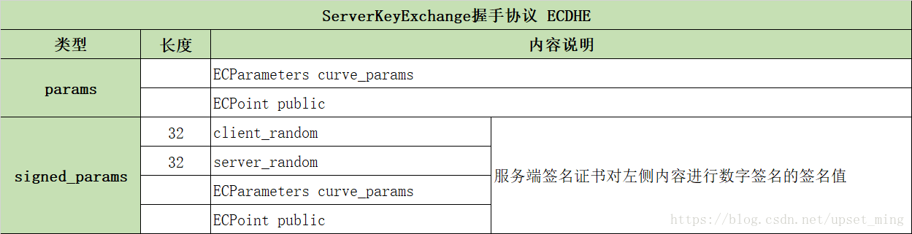

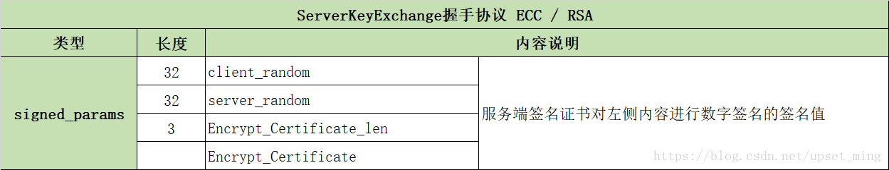

1、数据包：

```
>>> ??? [length 0005]
    16 01 01 00 4e
>>> TLS 1.1 Handshake [length 004e], ServerKeyExchange
    0c 00 00 4a 00 48 30 46 02 21 00 b0 4b 0a a7 23
    2a 35 43 49 a3 85 26 9e 09 63 0e f8 fd cb 79 39
    1d 2f f8 68 4c aa cd 0e 61 fd e7 02 21 00 a8 4c
    45 50 17 13 43 07 a7 08 44 b5 bf 73 ed 01 06 71
    bf fb 62 8f 9c 1b 2e 91 0a 71 f8 60 25 9c
```

2、数据包ServerKeyExchange解析

```
0c -->ServerKeyExchange 报文标识
00 00 4a  -->后续报文总长度
00 48 -->签名的数据长度
30 46 02 21 00 b0 4b 0a a7 23
2a 35 43 49 a3 85 26 9e 09 63 0e f8 fd cb 79 39
1d 2f f8 68 4c aa cd 0e 61 fd e7 02 21 00 a8 4c
45 50 17 13 43 07 a7 08 44 b5 bf 73 ed 01 06 71
bf fb 62 8f 9c 1b 2e 91 0a 71 f8 60 25 9c --> SS_signture(client_random+server_random+se_len+se)[服务端SS证书对 client随机数+server随机数+加密证书总长度+加密证书内容的 签名后的值。
```

3、ServerKeyExchange 签名的数据的计算

待签名的内容：

```
1、client_random=403cc1b00baab1e6e5c060281a2f9f2f90ed750c709ca1f1fdeafde6247fea4d
2、server_random=07dff5f4a9c898f1e83de6f1b0fd5722e4e77cae0985e568275963f9bc1fb732
3、se_len=00021d
4、se_cert=30820219308201c0a00302010202090093eced1db7b5296e300a06082a811ccf55018375308182310b300906035504061302434e310b300906035504080c02424a3110300e06035504070c074861694469616e31253023060355040a0c1c4265696a696e67204a4e544120546563686e6f6c6f6779204c54442e31153013060355040b0c0c534f5242206f6620544153533116301406035504030c0d546573742043412028534d3229301e170d3230303632333033313034365a170d3234303830313033313034365a308185310b300906035504061302434e310b300906035504080c02424a3110300e06035504070c074861694469616e31253023060355040a0c1c4265696a696e67204a4e544120546563686e6f6c6f6779204c54442e31153013060355040b0c0c42535243206f6620544153533119301706035504030c1073657276657220656e632028534d32293059301306072a8648ce3d020106082a811ccf5501822d03420004d712ffb5d887aef68fa30a808ec24c9ba575267844cefea2847a222a51013168a3ef609d870e67358a820733e28e27fdfa3ae207e8c1988976497d9433836c50a31a301830090603551d1304023000300b0603551d0f040403020338300a06082a811ccf55018375034700304402207395a8969b1634918a011cf031de67302b6bd6c79290b529609ab685dd8205080220328c1ff8262c746f461cbdf2c2b2ff108c9eba9070d7138d924c8dd8d15f0a47
```

计算 代码 cmd/ServerKeyExchange.go

```go
//备注：编译命令   go build -mod=vendor cmd/ServerKeyExchange.go
//备注："github.com/tjfoc/gmsm/sm2" master版本是有问题的
func ServerKeyExchange() {
	client_random := "403cc1b00baab1e6e5c060281a2f9f2f90ed750c709ca1f1fdeafde6247fea4d"
	server_random := "07dff5f4a9c898f1e83de6f1b0fd5722e4e77cae0985e568275963f9bc1fb732"
	se_len := "00021d"
	se_cert_hex := "30820219308201c0a00302010202090093eced1db7b5296e300a06082a811ccf55018375308182310b300906035504061302434e310b300906035504080c02424a3110300e06035504070c074861694469616e31253023060355040a0c1c4265696a696e67204a4e544120546563686e6f6c6f6779204c54442e31153013060355040b0c0c534f5242206f6620544153533116301406035504030c0d546573742043412028534d3229301e170d3230303632333033313034365a170d3234303830313033313034365a308185310b300906035504061302434e310b300906035504080c02424a3110300e06035504070c074861694469616e31253023060355040a0c1c4265696a696e67204a4e544120546563686e6f6c6f6779204c54442e31153013060355040b0c0c42535243206f6620544153533119301706035504030c1073657276657220656e632028534d32293059301306072a8648ce3d020106082a811ccf5501822d03420004d712ffb5d887aef68fa30a808ec24c9ba575267844cefea2847a222a51013168a3ef609d870e67358a820733e28e27fdfa3ae207e8c1988976497d9433836c50a31a301830090603551d1304023000300b0603551d0f040403020338300a06082a811ccf55018375034700304402207395a8969b1634918a011cf031de67302b6bd6c79290b529609ab685dd8205080220328c1ff8262c746f461cbdf2c2b2ff108c9eba9070d7138d924c8dd8d15f0a47"

	//ss服务端证书
	ss_cert_hex := "3082021a308201c1a00302010202090093eced1db7b5296d300a06082a811ccf55018375308182310b300906035504061302434e310b300906035504080c02424a3110300e06035504070c074861694469616e31253023060355040a0c1c4265696a696e67204a4e544120546563686e6f6c6f6779204c54442e31153013060355040b0c0c534f5242206f6620544153533116301406035504030c0d546573742043412028534d3229301e170d3230303632333033313034365a170d3234303830313033313034365a308186310b300906035504061302434e310b300906035504080c02424a3110300e06035504070c074861694469616e31253023060355040a0c1c4265696a696e67204a4e544120546563686e6f6c6f6779204c54442e31153013060355040b0c0c42535243206f662054415353311a301806035504030c11736572766572207369676e2028534d32293059301306072a8648ce3d020106082a811ccf5501822d034200043afd5333584a347fde39ab18c51d3b137020024b5db125228d86748b257fbb73ffea061f0d5fd4ad28e26d292b50c0d52d93c1db733141441a009cd10ad09a7ba31a301830090603551d1304023000300b0603551d0f0404030206c0300a06082a811ccf550183750347003044021f49b61b3d68462ba2d77c210dc34133ba6d858d2ee843ae5690b50f43d1d285022100f5d1b83500f8b16946e5577f98891e73b0ac270fe8eeda850090644cd430fc05"
	//签名的结果数据
	verify_out_hex := "3046022100b04b0aa7232a354349a385269e09630ef8fdcb79391d2ff8684caacd0e61fde7022100a84c455017134307a70844b5bf73ed010671bffb628f9c1b2e910a71f860259c"
	signture_data_hex := client_random + server_random + se_len + se_cert_hex
	signture_data, _ := hex.DecodeString(signture_data_hex)
	verify_out, _ := hex.DecodeString(verify_out_hex)
	ss_cert_data, _ := hex.DecodeString(ss_cert_hex)

	ss_cert, err := sm2.ParseCertificate(ss_cert_data)
	if err != nil {
		fmt.Println("sm2 ParseCertificate err->", err)
		return
	}
	//解析出公钥
	pubk, ok := ss_cert.PublicKey.(*sm2.PublicKey)
	fmt.Println("ok->", ok)
	if !ok {
		fmt.Println("ok pubk->", pubk)
		//		fmt.Println("ok pub X->", pubk.X.Text(16))
		//		fmt.Println("ok pub Y->", pubk.Y.Text(16))
		return
	}
	fmt.Println("Verify out->", pubk.Verify(signture_data, verify_out))
}
```

结果：

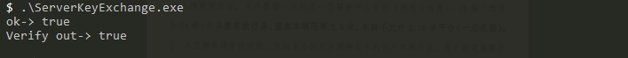

### ServerHelloDone（服务端响应）


1、数据包

```
>>> ??? [length 0005]
    16 01 01 00 04
>>> TLS 1.1 Handshake [length 0004], ServerHelloDone
    0e 00 00 00
```

2、数据包分析

```
0e -->  ServerHelloDone 标识
00 00 00 -->3个字节的长度值
```

### ClientKeyExchange（客户端响应）

```
1、加密数据长度（2个字节）+加密数据值
2、加密的数据是48个字节的主秘钥[2个字节的版本号+46个字节的随机数]
```


1、数据包

```
<<< ??? [length 0005]
    16 01 01 00 a3
<<< TLS 1.1 Handshake [length 00a3], ClientKeyExchange
    10 00 00 9f 00 9d 30 81 9a 02 21 00 e8 32 de 8d
    e2 a1 87 4f bb fa ec c4 b7 31 56 a8 01 94 bf cd
    87 cd 36 95 5e 6b 72 18 da 9e bf 85 02 21 00 a4
    a2 60 2f 5f 69 5b 79 41 2d aa 8d 94 1b e4 2b 61
    57 a9 17 be 2d 79 59 fd ae d1 4f 2d 5b 5b 1d 04
    20 8f 82 60 1a 67 c5 85 46 86 ed 45 d9 51 8a 3f
    3e d5 f5 fa ee 65 84 ff 9d 89 68 ff c0 c0 cf 85
    3c 04 30 20 0c 35 f0 fe 14 fc 0e a1 b6 56 c5 31
    7a 5b 7b 60 bb c1 39 a4 26 95 50 ad 5f 82 6e d2
    f1 2c fd 54 32 22 29 1c ee 75 a6 37 b0 d5 10 cc
    e7 2e f6
```

2、数据包协议分析

```
10 -->ClientKeyExchange 标识
00 00 9f  -->后续报文长度
00 9d -->加密后的数据长度
30 81 9a 02 21 00 e8 32 de 8d
e2 a1 87 4f bb fa ec c4 b7 31 56 a8 01 94 bf cd
87 cd 36 95 5e 6b 72 18 da 9e bf 85 02 21 00 a4
a2 60 2f 5f 69 5b 79 41 2d aa 8d 94 1b e4 2b 61
57 a9 17 be 2d 79 59 fd ae d1 4f 2d 5b 5b 1d 04
20 8f 82 60 1a 67 c5 85 46 86 ed 45 d9 51 8a 3f
3e d5 f5 fa ee 65 84 ff 9d 89 68 ff c0 c0 cf 85
3c 04 30 20 0c 35 f0 fe 14 fc 0e a1 b6 56 c5 31
7a 5b 7b 60 bb c1 39 a4 26 95 50 ad 5f 82 6e d2
f1 2c fd 54 32 22 29 1c ee 75 a6 37 b0 d5 10 cc
e7 2e f6 -->加密的数据内容
```

3、预处理主秘钥解密数据代码


```
1、ClientKeyExchange 是加密后的数据。个是ANS格式。因此需要先解码。
2、ANS的具体格式为：
  type AnsSm2EnData struct {
	X    *big.Int
	Y    *big.Int
	Hash []byte
	Data []byte
}
3、在有些资料文档中，对于这个加密的组织方式是不一样的分为2钟格式:C1+C3+C2 或者C1+C2+C3 这个要区分来。
4、sm234_tools.exe 工具的加密后的格式为：C1+C2+C3
5、go语言的sm2的库加密之后的格式为："04"+C1+C3+C2 因此在使用库的时候要注意加解密的格式

```

```
//使用golang解密的代码见：ClientKeyExchange.go 代码
//关键处理流程
1、ANS格式解码数据，得到C1（X,Y）,C2,C3等数据值。
2、依据C1,C2,C3的值拼接待解密字符串："04"+C1+C3+C2
3、读取加密秘钥私钥：SE.key.pem 
4、使用私钥解密待解密字符串。
```


4、重要字段数据：解密后的数据

```
#预处理主秘钥,主要用于实现获取到Master_Key计算
PRE_MASTER_KEY=01017a57183fe024794f9909061b73d2bf8bd600b0abc0d6dc6e4e11202ffe3a75b708af9488b89235161c3ef8381ad3
```

5、工具加解密

备注：使用不同的工具用于验证算法库的正确性，有些算法库default_uid是不样的。导致加解密的结果是不一样的。

a、gmssl 命令的库的使用（这有单独提供sm2加解密的动作）

```shell
############################gmssl 加解密处理###############################
##将16进字符转换为2进制文件
echo 30819a022100e832de8de2a1874fbbfaecc4b73156a80194bfcd87cd36955e6b7218da9ebf85022100a4a2602f5f695b79412daa8d941be42b6157a917be2d7959fdaed14f2d5b5b1d04208f82601a67c5854686ed45d9518a3f3ed5f5faee6584ff9d8968ffc0c0cf853c0430200c35f0fe14fc0ea1b656c5317a5b7b60bbc139a4269550ad5f826ed2f12cfd543222291cee75a637b0d510cce72ef6 | xxd -r -ps >bin.txt

##解密 ClientKeyExchange
 gmssl sm2utl -decrypt -inkey key.pem -in bin.txt |xxd
```

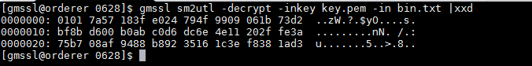

```
0000000: 0101 7a57 183f e024 794f 9909 061b 73d2  ..zW.?.$yO....s.
0000010: bf8b d600 b0ab c0d6 dc6e 4e11 202f fe3a  .........nN. /.:
0000020: 75b7 08af 9488 b892 3516 1c3e f838 1ad3  u.......5..>.8..
备注：字节刚好是2（版本号）+46（随机key）=48个字节
```

b、gmssl常用的一些加解密

```
gmssl sm2utl -encrypt -certin -inkey SE.cert.pem -in aa.out --使用证书方式加密 包含公钥
gmssl sm2 -pubout -in SE.key.pem -out SE.PUB.pem --从私钥中导出一个公钥
gmssl sm2utl -encrypt -pubin -inkey SE.PUB.pem -in aa.out >en7.pub.out --使用公钥方式加密
gmssl sm2utl -decrypt -inkey SE.key.pem -in ciphertext.sm2 >aa.out --使用私钥进行解密
```

c、使用工具加密

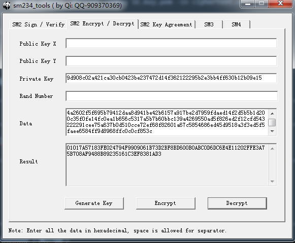

备注：

```
Private Key 是：sm2的私钥的解密的
prvcert, _ := sm2.ParsePKCS8UnecryptedPrivateKey(block.Bytes)
PrivateKey=prvcert.D.Text(16)
```


### ChangeCipherSpec（客户端）

1、数据包

```
<<< ??? [length 0005]
    14 01 01 00 01
<<< TLS 1.1 ChangeCipherSpec [length 0001]
    01
```

2、数据包协议分析

```
01 --只有一个标识字段
```

### Finished （客户端）

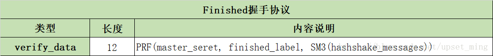

1、数据包

```
<<< ??? [length 0005]
    16 01 01 00 50
<<< TLS 1.1 Handshake [length 0010], Finished
    14 00 00 0c 1a 77 09 fc 45 d8 9f 5b 1c 8e 53 ab
```

2、数据包协议分析

```
14 --> Finished 标识
00 00 0c  -->长度
1a 77 09 fc 45 d8 9f 5b 1c 8e 53 ab  -->算法的校验数据（这层有2个意思，1交易的完整性交易，2是协商的密钥和加密的完整性。）
```

3、校验数据的计算说明

```
verify_data=PRF(master_seretkey,finished_label,SM3(hashshake_message))
#校验位的计算，有以下的一些参数
1、master_seretkey 交互过程中加密的主秘钥
2、finished_label client端使用："client finished" Server端计算使用："server finished"
3、SM3:国密sm3 hash算法。
4、hashshake_message 从交易开始，直到发送Finished 消息前，本端收到和发送的所有的数据的（不包括本消息，以及密钥变更消息，切类型为
type=0x16 shake类型 的才是计算的数据内容）（注意这里的数据 从记录层看 只包含framgent里面的内容，即握手的
实际内容，并不包括完成记录层的数据值）见下图
```

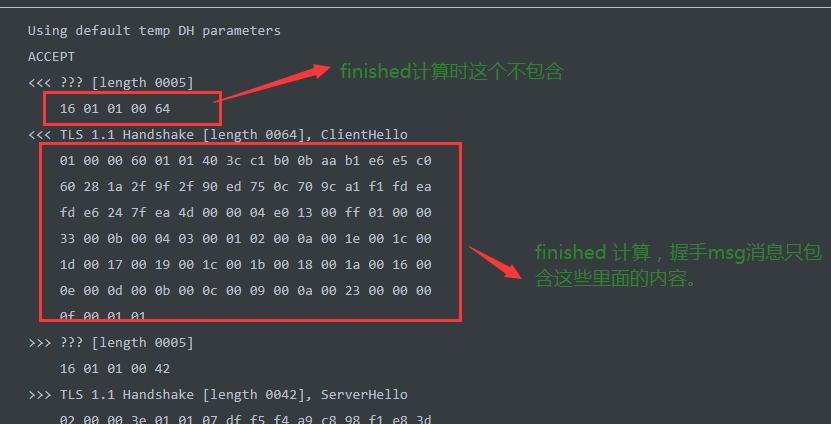

4、数据的来源

```
#master_key 我们先从client端打印的日志中提取，后续补充master_key的计算过程。
master_seretkey="C0FD5FC6695990D23892D56590AB7CFA9B692CA6A27C801C42D85BA297666ADEA93211385C3E9C30B9A30E4C8BBA66C3"

#finished_label 我们这里只计算client端的，服务端类似
finished_label="client finished"

#hashshake_message 这里只示意数据，具体数据见代码,为节省段落，只保留计算后的sm3 hash值
sm3(hashshake_message)=70FE56F84606F44CDD633CC16604013DC5E8D6D9E3265D6B76EE42E68A5A0CFB

#待对比的校验的数据
verify_data:=1a7709fc45d89f5b1c8e53ab
```

```
#client的数据hashshake_message
#hashshake_message=ClientHello+ServerHello+Certificate+ServerKeyExchange+ServerHelloDone+ClientKeyExchange
<<< TLS 1.1 Handshake [length 0064], ClientHello
    01 00 00 60 01 01 40 3c c1 b0 0b aa b1 e6 e5 c0
    60 28 1a 2f 9f 2f 90 ed 75 0c 70 9c a1 f1 fd ea
    fd e6 24 7f ea 4d 00 00 04 e0 13 00 ff 01 00 00
    33 00 0b 00 04 03 00 01 02 00 0a 00 1e 00 1c 00
    1d 00 17 00 19 00 1c 00 1b 00 18 00 1a 00 16 00
    0e 00 0d 00 0b 00 0c 00 09 00 0a 00 23 00 00 00
    0f 00 01 01
>>> TLS 1.1 Handshake [length 0042], ServerHello
    02 00 00 3e 01 01 07 df f5 f4 a9 c8 98 f1 e8 3d
    e6 f1 b0 fd 57 22 e4 e7 7c ae 09 85 e5 68 27 59
    63 f9 bc 1f b7 32 00 e0 13 00 00 16 ff 01 00 01
    00 00 0b 00 04 03 00 01 02 00 23 00 00 00 0f 00
    01 01
>>> TLS 1.1 Handshake [length 06a8], Certificate
    0b 00 06 a4 00 06 a1 00 02 1e 30 82 02 1a 30 82
    01 c1 a0 03 02 01 02 02 09 00 93 ec ed 1d b7 b5
    29 6d 30 0a 06 08 2a 81 1c cf 55 01 83 75 30 81
    82 31 0b 30 09 06 03 55 04 06 13 02 43 4e 31 0b
    30 09 06 03 55 04 08 0c 02 42 4a 31 10 30 0e 06
    03 55 04 07 0c 07 48 61 69 44 69 61 6e 31 25 30
    23 06 03 55 04 0a 0c 1c 42 65 69 6a 69 6e 67 20
    4a 4e 54 41 20 54 65 63 68 6e 6f 6c 6f 67 79 20
    4c 54 44 2e 31 15 30 13 06 03 55 04 0b 0c 0c 53
    4f 52 42 20 6f 66 20 54 41 53 53 31 16 30 14 06
    03 55 04 03 0c 0d 54 65 73 74 20 43 41 20 28 53
    4d 32 29 30 1e 17 0d 32 30 30 36 32 33 30 33 31
    30 34 36 5a 17 0d 32 34 30 38 30 31 30 33 31 30
    34 36 5a 30 81 86 31 0b 30 09 06 03 55 04 06 13
    02 43 4e 31 0b 30 09 06 03 55 04 08 0c 02 42 4a
    31 10 30 0e 06 03 55 04 07 0c 07 48 61 69 44 69
    61 6e 31 25 30 23 06 03 55 04 0a 0c 1c 42 65 69
    6a 69 6e 67 20 4a 4e 54 41 20 54 65 63 68 6e 6f
    6c 6f 67 79 20 4c 54 44 2e 31 15 30 13 06 03 55
    04 0b 0c 0c 42 53 52 43 20 6f 66 20 54 41 53 53
    31 1a 30 18 06 03 55 04 03 0c 11 73 65 72 76 65
    72 20 73 69 67 6e 20 28 53 4d 32 29 30 59 30 13
    06 07 2a 86 48 ce 3d 02 01 06 08 2a 81 1c cf 55
    01 82 2d 03 42 00 04 3a fd 53 33 58 4a 34 7f de
    39 ab 18 c5 1d 3b 13 70 20 02 4b 5d b1 25 22 8d
    86 74 8b 25 7f bb 73 ff ea 06 1f 0d 5f d4 ad 28
    e2 6d 29 2b 50 c0 d5 2d 93 c1 db 73 31 41 44 1a
    00 9c d1 0a d0 9a 7b a3 1a 30 18 30 09 06 03 55
    1d 13 04 02 30 00 30 0b 06 03 55 1d 0f 04 04 03
    02 06 c0 30 0a 06 08 2a 81 1c cf 55 01 83 75 03
    47 00 30 44 02 1f 49 b6 1b 3d 68 46 2b a2 d7 7c
    21 0d c3 41 33 ba 6d 85 8d 2e e8 43 ae 56 90 b5
    0f 43 d1 d2 85 02 21 00 f5 d1 b8 35 00 f8 b1 69
    46 e5 57 7f 98 89 1e 73 b0 ac 27 0f e8 ee da 85
    00 90 64 4c d4 30 fc 05 00 02 5d 30 82 02 59 30
    82 02 00 a0 03 02 01 02 02 09 00 ef 22 e3 6e 32
    51 c4 e9 30 0a 06 08 2a 81 1c cf 55 01 83 75 30
    81 82 31 0b 30 09 06 03 55 04 06 13 02 43 4e 31
    0b 30 09 06 03 55 04 08 0c 02 42 4a 31 10 30 0e
    06 03 55 04 07 0c 07 48 61 69 44 69 61 6e 31 25
    30 23 06 03 55 04 0a 0c 1c 42 65 69 6a 69 6e 67
    20 4a 4e 54 41 20 54 65 63 68 6e 6f 6c 6f 67 79
    20 4c 54 44 2e 31 15 30 13 06 03 55 04 0b 0c 0c
    53 4f 52 42 20 6f 66 20 54 41 53 53 31 16 30 14
    06 03 55 04 03 0c 0d 54 65 73 74 20 43 41 20 28
    53 4d 32 29 30 1e 17 0d 32 30 30 36 32 33 30 33
    31 30 34 36 5a 17 0d 32 34 30 38 30 31 30 33 31
    30 34 36 5a 30 81 82 31 0b 30 09 06 03 55 04 06
    13 02 43 4e 31 0b 30 09 06 03 55 04 08 0c 02 42
    4a 31 10 30 0e 06 03 55 04 07 0c 07 48 61 69 44
    69 61 6e 31 25 30 23 06 03 55 04 0a 0c 1c 42 65
    69 6a 69 6e 67 20 4a 4e 54 41 20 54 65 63 68 6e
    6f 6c 6f 67 79 20 4c 54 44 2e 31 15 30 13 06 03
    55 04 0b 0c 0c 53 4f 52 42 20 6f 66 20 54 41 53
    53 31 16 30 14 06 03 55 04 03 0c 0d 54 65 73 74
    20 43 41 20 28 53 4d 32 29 30 59 30 13 06 07 2a
    86 48 ce 3d 02 01 06 08 2a 81 1c cf 55 01 82 2d
    03 42 00 04 f1 db b0 f5 40 da 8c ba b8 01 0e d8
    28 af 66 28 8d f6 ae 81 4b 08 7f 97 30 15 6b 67
    cd 9d 90 82 fe 00 2f 76 72 e3 bb d1 1c ff 16 62
    47 f6 89 38 99 df a3 d9 f6 39 9d 7d 27 19 13 80
    ea 81 b2 89 a3 5d 30 5b 30 1d 06 03 55 1d 0e 04
    16 04 14 0e ea 3c 16 b9 49 c8 d8 96 99 47 46 2f
    f1 dd cc 2e 25 f8 ac 30 1f 06 03 55 1d 23 04 18
    30 16 80 14 0e ea 3c 16 b9 49 c8 d8 96 99 47 46
    2f f1 dd cc 2e 25 f8 ac 30 0c 06 03 55 1d 13 04
    05 30 03 01 01 ff 30 0b 06 03 55 1d 0f 04 04 03
    02 01 06 30 0a 06 08 2a 81 1c cf 55 01 83 75 03
    47 00 30 44 02 20 0c bf b0 b8 c3 93 4c 18 d9 04
    b4 bf 69 cf 21 a1 7c 5d 1c e1 f1 6b f7 e4 95 21
    98 2d b3 1c a0 72 02 20 74 d3 78 2f d3 3d 5b d7
    87 39 c0 31 ec 2d 1f 06 8b 2e 81 16 cc c1 c8 32
    d1 43 95 49 bf 7c 13 40 00 02 1d 30 82 02 19 30
    82 01 c0 a0 03 02 01 02 02 09 00 93 ec ed 1d b7
    b5 29 6e 30 0a 06 08 2a 81 1c cf 55 01 83 75 30
    81 82 31 0b 30 09 06 03 55 04 06 13 02 43 4e 31
    0b 30 09 06 03 55 04 08 0c 02 42 4a 31 10 30 0e
    06 03 55 04 07 0c 07 48 61 69 44 69 61 6e 31 25
    30 23 06 03 55 04 0a 0c 1c 42 65 69 6a 69 6e 67
    20 4a 4e 54 41 20 54 65 63 68 6e 6f 6c 6f 67 79
    20 4c 54 44 2e 31 15 30 13 06 03 55 04 0b 0c 0c
    53 4f 52 42 20 6f 66 20 54 41 53 53 31 16 30 14
    06 03 55 04 03 0c 0d 54 65 73 74 20 43 41 20 28
    53 4d 32 29 30 1e 17 0d 32 30 30 36 32 33 30 33
    31 30 34 36 5a 17 0d 32 34 30 38 30 31 30 33 31
    30 34 36 5a 30 81 85 31 0b 30 09 06 03 55 04 06
    13 02 43 4e 31 0b 30 09 06 03 55 04 08 0c 02 42
    4a 31 10 30 0e 06 03 55 04 07 0c 07 48 61 69 44
    69 61 6e 31 25 30 23 06 03 55 04 0a 0c 1c 42 65
    69 6a 69 6e 67 20 4a 4e 54 41 20 54 65 63 68 6e
    6f 6c 6f 67 79 20 4c 54 44 2e 31 15 30 13 06 03
    55 04 0b 0c 0c 42 53 52 43 20 6f 66 20 54 41 53
    53 31 19 30 17 06 03 55 04 03 0c 10 73 65 72 76
    65 72 20 65 6e 63 20 28 53 4d 32 29 30 59 30 13
    06 07 2a 86 48 ce 3d 02 01 06 08 2a 81 1c cf 55
    01 82 2d 03 42 00 04 d7 12 ff b5 d8 87 ae f6 8f
    a3 0a 80 8e c2 4c 9b a5 75 26 78 44 ce fe a2 84
    7a 22 2a 51 01 31 68 a3 ef 60 9d 87 0e 67 35 8a
    82 07 33 e2 8e 27 fd fa 3a e2 07 e8 c1 98 89 76
    49 7d 94 33 83 6c 50 a3 1a 30 18 30 09 06 03 55
    1d 13 04 02 30 00 30 0b 06 03 55 1d 0f 04 04 03
    02 03 38 30 0a 06 08 2a 81 1c cf 55 01 83 75 03
    47 00 30 44 02 20 73 95 a8 96 9b 16 34 91 8a 01
    1c f0 31 de 67 30 2b 6b d6 c7 92 90 b5 29 60 9a
    b6 85 dd 82 05 08 02 20 32 8c 1f f8 26 2c 74 6f
    46 1c bd f2 c2 b2 ff 10 8c 9e ba 90 70 d7 13 8d
    92 4c 8d d8 d1 5f 0a 47
>>> TLS 1.1 Handshake [length 004e], ServerKeyExchange
    0c 00 00 4a 00 48 30 46 02 21 00 b0 4b 0a a7 23
    2a 35 43 49 a3 85 26 9e 09 63 0e f8 fd cb 79 39
    1d 2f f8 68 4c aa cd 0e 61 fd e7 02 21 00 a8 4c
    45 50 17 13 43 07 a7 08 44 b5 bf 73 ed 01 06 71
    bf fb 62 8f 9c 1b 2e 91 0a 71 f8 60 25 9c
>>> TLS 1.1 Handshake [length 0004], ServerHelloDone
    0e 00 00 00
<<< TLS 1.1 Handshake [length 00a3], ClientKeyExchange
    10 00 00 9f 00 9d 30 81 9a 02 21 00 e8 32 de 8d
    e2 a1 87 4f bb fa ec c4 b7 31 56 a8 01 94 bf cd
    87 cd 36 95 5e 6b 72 18 da 9e bf 85 02 21 00 a4
    a2 60 2f 5f 69 5b 79 41 2d aa 8d 94 1b e4 2b 61
    57 a9 17 be 2d 79 59 fd ae d1 4f 2d 5b 5b 1d 04
    20 8f 82 60 1a 67 c5 85 46 86 ed 45 d9 51 8a 3f
    3e d5 f5 fa ee 65 84 ff 9d 89 68 ff c0 c0 cf 85
    3c 04 30 20 0c 35 f0 fe 14 fc 0e a1 b6 56 c5 31
    7a 5b 7b 60 bb c1 39 a4 26 95 50 ad 5f 82 6e d2
    f1 2c fd 54 32 22 29 1c ee 75 a6 37 b0 d5 10 cc
    e7 2e f6
```

5、核心代码以及代码文件

完整代码见：cmd/ClientFinished.go


```go
//核心代码
func pHash(result, secret, seed []byte, hash func() hash.Hash) {
	h := hmac.New(hash, secret)
	h.Write(seed)
	a := h.Sum(nil)
	j := 0
	for j < len(result) {
		h.Reset()
		h.Write(a)
		h.Write(seed)
		b := h.Sum(nil)
		todo := len(b)
		if j+todo > len(result) {
			todo = len(result) - j
		}
		copy(result[j:j+todo], b)
		j += todo

		h.Reset()
		h.Write(a)
		a = h.Sum(nil)
	}
}

func PRF(masterkey, finished_label, sm3Hash []byte) string {
	result := make([]byte, 12) //finished计算的校验位只有12个字节
	seed := make([]byte, 0)
	seed = append(seed, finished_label...)
	seed = append(seed, sm3Hash...)
	pHash(result, masterkey, seed, sm3.New)
	fmt.Println("result out->", hex.EncodeToString(result))
	return hex.EncodeToString(result)
}
```

代码输出结果：

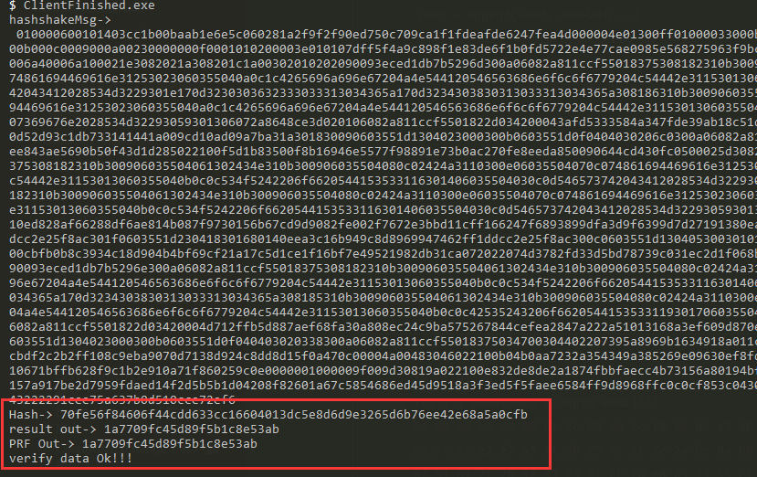

### NewSessionTicket （服务端）

1、数据包

```
>>> ??? [length 0005]
    16 01 01 00 aa
>>> TLS 1.1 Handshake [length 00aa]???
    04 00 00 a6 00 00 01 2c 00 a0 2c f0 bd bb e2 d0
    56 7c 2c e2 f7 55 f1 d0 75 4c 71 7e 2a be 9a 60
    07 51 84 7f 7b 92 43 73 41 2f f0 e8 65 43 55 c1
    f2 fb 1b ad b2 8d 13 c5 a9 2f 16 61 45 0e 77 bb
    bf 68 b3 60 16 4b 23 a9 a9 0e 60 26 3c da 87 de
    df c2 43 f6 f6 8d e0 e6 a2 f9 13 d0 0f 1b 65 8f
    73 3f 5f 03 e1 c5 53 51 10 2c 7f 8f a5 a2 8f 44
    28 bd aa aa 46 f5 54 b2 1c 19 9c df 79 98 e8 08
    fb 14 97 45 9d bc 97 9f 5e 2a a5 e6 77 09 a3 d4
    6e 31 63 8f a0 f6 aa 64 42 50 6e be 40 a3 8b ae
    4c b5 1f e3 b9 34 f6 23 b7 a6
```

2、数据包协议解析

```
04 -->NewSessionTicket 
00 00 a6 -->后面总长度
00 00 01 2c -->应该是某种标识，不知道含义
00 a0 -->后面的总长度
2c f0 bd bb e2 d0
56 7c 2c e2 f7 55 f1 d0 75 4c 71 7e 2a be 9a 60
07 51 84 7f 7b 92 43 73 41 2f f0 e8 65 43 55 c1
f2 fb 1b ad b2 8d 13 c5 a9 2f 16 61 45 0e 77 bb
bf 68 b3 60 16 4b 23 a9 a9 0e 60 26 3c da 87 de
df c2 43 f6 f6 8d e0 e6 a2 f9 13 d0 0f 1b 65 8f
73 3f 5f 03 e1 c5 53 51 10 2c 7f 8f a5 a2 8f 44
28 bd aa aa 46 f5 54 b2 1c 19 9c df 79 98 e8 08
fb 14 97 45 9d bc 97 9f 5e 2a a5 e6 77 09 a3 d4
6e 31 63 8f a0 f6 aa 64 42 50 6e be 40 a3 8b ae
4c b5 1f e3 b9 34 f6 23 b7 a6
```


### ChangeCipherSpec（服务端）

密码变更协议：非握手协议里面的内容握手协议第一个标识为0x16


1、数据包

```
>>> ??? [length 0005]
    14 01 01 00 01
>>> TLS 1.1 ChangeCipherSpec [length 0001]
    01
```

2、数据包协议分析

```
01 -->ChangeCipherSpec 标识
```

### Finished（服务端）


1、数据包

```
>>> ??? [length 0005]
    16 01 01 00 50
>>> TLS 1.1 Handshake [length 0010], Finished
    14 00 00 0c b7 aa ba 4f 95 3b b2 6d 5b 07 0d 52
```

2、数据包协议分析

```
14 --> Finished 标识
00 00 0c  -->长度
b7 aa ba 4f 95 3b b2 6d 5b 07 0d 52  -->算法的校验数据（这层有2个意思，1交易的完整性交易，2是协商的密钥和加密的完整性。）
```

3、校验数据的计算说明

```
verify_data=PRF(master_seretkey,finished_label,SM3(hashshake_message))

#master_key 我们先从client端打印的日志中提取，后续补充master_key的计算过程。
master_seretkey="C0FD5FC6695990D23892D56590AB7CFA9B692CA6A27C801C42D85BA297666ADEA93211385C3E9C30B9A30E4C8BBA66C3"

#finished_label 我们这里只计算client端的，服务端类似
finished_label="server finished"

#hashshake_message 这里只示意数据，具体数据见代码,为节省段落，只保留计算后的sm3 hash值
sm3(hashshake_message)=d0aa1f16a9f95a029fafe8be86ece0e1860d2a95728e63f6c2cdf63e3dc65cf2

#待对比的校验的数据
verify_data:=b7aaba4f953bb26d5b070d52
```

4、待校验的数据

```
<<< TLS 1.1 Handshake [length 0064], ClientHello
    01 00 00 60 01 01 40 3c c1 b0 0b aa b1 e6 e5 c0
    60 28 1a 2f 9f 2f 90 ed 75 0c 70 9c a1 f1 fd ea
    fd e6 24 7f ea 4d 00 00 04 e0 13 00 ff 01 00 00
    33 00 0b 00 04 03 00 01 02 00 0a 00 1e 00 1c 00
    1d 00 17 00 19 00 1c 00 1b 00 18 00 1a 00 16 00
    0e 00 0d 00 0b 00 0c 00 09 00 0a 00 23 00 00 00
    0f 00 01 01
>>> TLS 1.1 Handshake [length 0042], ServerHello
    02 00 00 3e 01 01 07 df f5 f4 a9 c8 98 f1 e8 3d
    e6 f1 b0 fd 57 22 e4 e7 7c ae 09 85 e5 68 27 59
    63 f9 bc 1f b7 32 00 e0 13 00 00 16 ff 01 00 01
    00 00 0b 00 04 03 00 01 02 00 23 00 00 00 0f 00
    01 01
>>> TLS 1.1 Handshake [length 06a8], Certificate
    0b 00 06 a4 00 06 a1 00 02 1e 30 82 02 1a 30 82
    01 c1 a0 03 02 01 02 02 09 00 93 ec ed 1d b7 b5
    29 6d 30 0a 06 08 2a 81 1c cf 55 01 83 75 30 81
    82 31 0b 30 09 06 03 55 04 06 13 02 43 4e 31 0b
    30 09 06 03 55 04 08 0c 02 42 4a 31 10 30 0e 06
    03 55 04 07 0c 07 48 61 69 44 69 61 6e 31 25 30
    23 06 03 55 04 0a 0c 1c 42 65 69 6a 69 6e 67 20
    4a 4e 54 41 20 54 65 63 68 6e 6f 6c 6f 67 79 20
    4c 54 44 2e 31 15 30 13 06 03 55 04 0b 0c 0c 53
    4f 52 42 20 6f 66 20 54 41 53 53 31 16 30 14 06
    03 55 04 03 0c 0d 54 65 73 74 20 43 41 20 28 53
    4d 32 29 30 1e 17 0d 32 30 30 36 32 33 30 33 31
    30 34 36 5a 17 0d 32 34 30 38 30 31 30 33 31 30
    34 36 5a 30 81 86 31 0b 30 09 06 03 55 04 06 13
    02 43 4e 31 0b 30 09 06 03 55 04 08 0c 02 42 4a
    31 10 30 0e 06 03 55 04 07 0c 07 48 61 69 44 69
    61 6e 31 25 30 23 06 03 55 04 0a 0c 1c 42 65 69
    6a 69 6e 67 20 4a 4e 54 41 20 54 65 63 68 6e 6f
    6c 6f 67 79 20 4c 54 44 2e 31 15 30 13 06 03 55
    04 0b 0c 0c 42 53 52 43 20 6f 66 20 54 41 53 53
    31 1a 30 18 06 03 55 04 03 0c 11 73 65 72 76 65
    72 20 73 69 67 6e 20 28 53 4d 32 29 30 59 30 13
    06 07 2a 86 48 ce 3d 02 01 06 08 2a 81 1c cf 55
    01 82 2d 03 42 00 04 3a fd 53 33 58 4a 34 7f de
    39 ab 18 c5 1d 3b 13 70 20 02 4b 5d b1 25 22 8d
    86 74 8b 25 7f bb 73 ff ea 06 1f 0d 5f d4 ad 28
    e2 6d 29 2b 50 c0 d5 2d 93 c1 db 73 31 41 44 1a
    00 9c d1 0a d0 9a 7b a3 1a 30 18 30 09 06 03 55
    1d 13 04 02 30 00 30 0b 06 03 55 1d 0f 04 04 03
    02 06 c0 30 0a 06 08 2a 81 1c cf 55 01 83 75 03
    47 00 30 44 02 1f 49 b6 1b 3d 68 46 2b a2 d7 7c
    21 0d c3 41 33 ba 6d 85 8d 2e e8 43 ae 56 90 b5
    0f 43 d1 d2 85 02 21 00 f5 d1 b8 35 00 f8 b1 69
    46 e5 57 7f 98 89 1e 73 b0 ac 27 0f e8 ee da 85
    00 90 64 4c d4 30 fc 05 00 02 5d 30 82 02 59 30
    82 02 00 a0 03 02 01 02 02 09 00 ef 22 e3 6e 32
    51 c4 e9 30 0a 06 08 2a 81 1c cf 55 01 83 75 30
    81 82 31 0b 30 09 06 03 55 04 06 13 02 43 4e 31
    0b 30 09 06 03 55 04 08 0c 02 42 4a 31 10 30 0e
    06 03 55 04 07 0c 07 48 61 69 44 69 61 6e 31 25
    30 23 06 03 55 04 0a 0c 1c 42 65 69 6a 69 6e 67
    20 4a 4e 54 41 20 54 65 63 68 6e 6f 6c 6f 67 79
    20 4c 54 44 2e 31 15 30 13 06 03 55 04 0b 0c 0c
    53 4f 52 42 20 6f 66 20 54 41 53 53 31 16 30 14
    06 03 55 04 03 0c 0d 54 65 73 74 20 43 41 20 28
    53 4d 32 29 30 1e 17 0d 32 30 30 36 32 33 30 33
    31 30 34 36 5a 17 0d 32 34 30 38 30 31 30 33 31
    30 34 36 5a 30 81 82 31 0b 30 09 06 03 55 04 06
    13 02 43 4e 31 0b 30 09 06 03 55 04 08 0c 02 42
    4a 31 10 30 0e 06 03 55 04 07 0c 07 48 61 69 44
    69 61 6e 31 25 30 23 06 03 55 04 0a 0c 1c 42 65
    69 6a 69 6e 67 20 4a 4e 54 41 20 54 65 63 68 6e
    6f 6c 6f 67 79 20 4c 54 44 2e 31 15 30 13 06 03
    55 04 0b 0c 0c 53 4f 52 42 20 6f 66 20 54 41 53
    53 31 16 30 14 06 03 55 04 03 0c 0d 54 65 73 74
    20 43 41 20 28 53 4d 32 29 30 59 30 13 06 07 2a
    86 48 ce 3d 02 01 06 08 2a 81 1c cf 55 01 82 2d
    03 42 00 04 f1 db b0 f5 40 da 8c ba b8 01 0e d8
    28 af 66 28 8d f6 ae 81 4b 08 7f 97 30 15 6b 67
    cd 9d 90 82 fe 00 2f 76 72 e3 bb d1 1c ff 16 62
    47 f6 89 38 99 df a3 d9 f6 39 9d 7d 27 19 13 80
    ea 81 b2 89 a3 5d 30 5b 30 1d 06 03 55 1d 0e 04
    16 04 14 0e ea 3c 16 b9 49 c8 d8 96 99 47 46 2f
    f1 dd cc 2e 25 f8 ac 30 1f 06 03 55 1d 23 04 18
    30 16 80 14 0e ea 3c 16 b9 49 c8 d8 96 99 47 46
    2f f1 dd cc 2e 25 f8 ac 30 0c 06 03 55 1d 13 04
    05 30 03 01 01 ff 30 0b 06 03 55 1d 0f 04 04 03
    02 01 06 30 0a 06 08 2a 81 1c cf 55 01 83 75 03
    47 00 30 44 02 20 0c bf b0 b8 c3 93 4c 18 d9 04
    b4 bf 69 cf 21 a1 7c 5d 1c e1 f1 6b f7 e4 95 21
    98 2d b3 1c a0 72 02 20 74 d3 78 2f d3 3d 5b d7
    87 39 c0 31 ec 2d 1f 06 8b 2e 81 16 cc c1 c8 32
    d1 43 95 49 bf 7c 13 40 00 02 1d 30 82 02 19 30
    82 01 c0 a0 03 02 01 02 02 09 00 93 ec ed 1d b7
    b5 29 6e 30 0a 06 08 2a 81 1c cf 55 01 83 75 30
    81 82 31 0b 30 09 06 03 55 04 06 13 02 43 4e 31
    0b 30 09 06 03 55 04 08 0c 02 42 4a 31 10 30 0e
    06 03 55 04 07 0c 07 48 61 69 44 69 61 6e 31 25
    30 23 06 03 55 04 0a 0c 1c 42 65 69 6a 69 6e 67
    20 4a 4e 54 41 20 54 65 63 68 6e 6f 6c 6f 67 79
    20 4c 54 44 2e 31 15 30 13 06 03 55 04 0b 0c 0c
    53 4f 52 42 20 6f 66 20 54 41 53 53 31 16 30 14
    06 03 55 04 03 0c 0d 54 65 73 74 20 43 41 20 28
    53 4d 32 29 30 1e 17 0d 32 30 30 36 32 33 30 33
    31 30 34 36 5a 17 0d 32 34 30 38 30 31 30 33 31
    30 34 36 5a 30 81 85 31 0b 30 09 06 03 55 04 06
    13 02 43 4e 31 0b 30 09 06 03 55 04 08 0c 02 42
    4a 31 10 30 0e 06 03 55 04 07 0c 07 48 61 69 44
    69 61 6e 31 25 30 23 06 03 55 04 0a 0c 1c 42 65
    69 6a 69 6e 67 20 4a 4e 54 41 20 54 65 63 68 6e
    6f 6c 6f 67 79 20 4c 54 44 2e 31 15 30 13 06 03
    55 04 0b 0c 0c 42 53 52 43 20 6f 66 20 54 41 53
    53 31 19 30 17 06 03 55 04 03 0c 10 73 65 72 76
    65 72 20 65 6e 63 20 28 53 4d 32 29 30 59 30 13
    06 07 2a 86 48 ce 3d 02 01 06 08 2a 81 1c cf 55
    01 82 2d 03 42 00 04 d7 12 ff b5 d8 87 ae f6 8f
    a3 0a 80 8e c2 4c 9b a5 75 26 78 44 ce fe a2 84
    7a 22 2a 51 01 31 68 a3 ef 60 9d 87 0e 67 35 8a
    82 07 33 e2 8e 27 fd fa 3a e2 07 e8 c1 98 89 76
    49 7d 94 33 83 6c 50 a3 1a 30 18 30 09 06 03 55
    1d 13 04 02 30 00 30 0b 06 03 55 1d 0f 04 04 03
    02 03 38 30 0a 06 08 2a 81 1c cf 55 01 83 75 03
    47 00 30 44 02 20 73 95 a8 96 9b 16 34 91 8a 01
    1c f0 31 de 67 30 2b 6b d6 c7 92 90 b5 29 60 9a
    b6 85 dd 82 05 08 02 20 32 8c 1f f8 26 2c 74 6f
    46 1c bd f2 c2 b2 ff 10 8c 9e ba 90 70 d7 13 8d
    92 4c 8d d8 d1 5f 0a 47
>>> TLS 1.1 Handshake [length 004e], ServerKeyExchange
    0c 00 00 4a 00 48 30 46 02 21 00 b0 4b 0a a7 23
    2a 35 43 49 a3 85 26 9e 09 63 0e f8 fd cb 79 39
    1d 2f f8 68 4c aa cd 0e 61 fd e7 02 21 00 a8 4c
    45 50 17 13 43 07 a7 08 44 b5 bf 73 ed 01 06 71
    bf fb 62 8f 9c 1b 2e 91 0a 71 f8 60 25 9c
>>> TLS 1.1 Handshake [length 0004], ServerHelloDone
    0e 00 00 00
<<< TLS 1.1 Handshake [length 00a3], ClientKeyExchange
    10 00 00 9f 00 9d 30 81 9a 02 21 00 e8 32 de 8d
    e2 a1 87 4f bb fa ec c4 b7 31 56 a8 01 94 bf cd
    87 cd 36 95 5e 6b 72 18 da 9e bf 85 02 21 00 a4
    a2 60 2f 5f 69 5b 79 41 2d aa 8d 94 1b e4 2b 61
    57 a9 17 be 2d 79 59 fd ae d1 4f 2d 5b 5b 1d 04
    20 8f 82 60 1a 67 c5 85 46 86 ed 45 d9 51 8a 3f
    3e d5 f5 fa ee 65 84 ff 9d 89 68 ff c0 c0 cf 85
    3c 04 30 20 0c 35 f0 fe 14 fc 0e a1 b6 56 c5 31
    7a 5b 7b 60 bb c1 39 a4 26 95 50 ad 5f 82 6e d2
    f1 2c fd 54 32 22 29 1c ee 75 a6 37 b0 d5 10 cc
    e7 2e f6
<<< TLS 1.1 Handshake [length 0010], Finished
    14 00 00 0c 1a 77 09 fc 45 d8 9f 5b 1c 8e 53 ab
>>> TLS 1.1 Handshake [length 00aa]  NewSessionTicket
    04 00 00 a6 00 00 01 2c 00 a0 2c f0 bd bb e2 d0
    56 7c 2c e2 f7 55 f1 d0 75 4c 71 7e 2a be 9a 60
    07 51 84 7f 7b 92 43 73 41 2f f0 e8 65 43 55 c1
    f2 fb 1b ad b2 8d 13 c5 a9 2f 16 61 45 0e 77 bb
    bf 68 b3 60 16 4b 23 a9 a9 0e 60 26 3c da 87 de
    df c2 43 f6 f6 8d e0 e6 a2 f9 13 d0 0f 1b 65 8f
    73 3f 5f 03 e1 c5 53 51 10 2c 7f 8f a5 a2 8f 44
    28 bd aa aa 46 f5 54 b2 1c 19 9c df 79 98 e8 08
    fb 14 97 45 9d bc 97 9f 5e 2a a5 e6 77 09 a3 d4
    6e 31 63 8f a0 f6 aa 64 42 50 6e be 40 a3 8b ae
    4c b5 1f e3 b9 34 f6 23 b7 a6

```

5、核心代码：

```
cmd/ServerFinished.go -->代码和clientFinished.go 完全一致，主要是部分数据不一样。
```

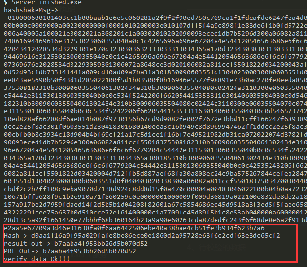

## MasterKey的计算

### 交互的密钥

备注：关于Master-Key 从client端的日志中提取出来的。

```
SSL-Session:
    Protocol  : TLSv1.1
    Cipher    : ECC-SM4-SM3
    Session-ID: 8673AA9B4BC8C43A73DAF4BA86705A2904224C4A0035E1773EBB0716ADD37423
    Session-ID-ctx:
    Master-Key: C0FD5FC6695990D23892D56590AB7CFA9B692CA6A27C801C42D85BA297666ADEA93211385C3E9C30B9A30E4C8BBA66C3
    Key-Arg   : None
    PSK identity: None
    PSK identity hint: None
    SRP username: None
    TLS session ticket lifetime hint: 300 (seconds)
    TLS session ticket:
    0000 - 2c f0 bd bb e2 d0 56 7c-2c e2 f7 55 f1 d0 75 4c   ,.....V|,..U..uL
    0010 - 71 7e 2a be 9a 60 07 51-84 7f 7b 92 43 73 41 2f   q~*..`.Q..{.CsA/
    0020 - f0 e8 65 43 55 c1 f2 fb-1b ad b2 8d 13 c5 a9 2f   ..eCU........../
    0030 - 16 61 45 0e 77 bb bf 68-b3 60 16 4b 23 a9 a9 0e   .aE.w..h.`.K#...
    0040 - 60 26 3c da 87 de df c2-43 f6 f6 8d e0 e6 a2 f9   `&<.....C.......
    0050 - 13 d0 0f 1b 65 8f 73 3f-5f 03 e1 c5 53 51 10 2c   ....e.s?_...SQ.,
    0060 - 7f 8f a5 a2 8f 44 28 bd-aa aa 46 f5 54 b2 1c 19   .....D(...F.T...
    0070 - 9c df 79 98 e8 08 fb 14-97 45 9d bc 97 9f 5e 2a   ..y......E....^*
    0080 - a5 e6 77 09 a3 d4 6e 31-63 8f a0 f6 aa 64 42 50   ..w...n1c....dBP
    0090 - 6e be 40 a3 8b ae 4c b5-1f e3 b9 34 f6 23 b7 a6   n.@...L....4.#..

    Start Time: 1592882248
    Timeout   : 7200 (sec)
    Verify return code: 19 (self signed certificate in certificate chain)
---
```


### MasterKey的计算公式

1、标准文档中的描述：

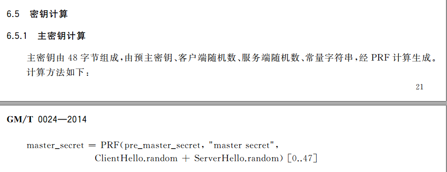

2、计算公式：

```
master_secret=PRF(pre_master_secret,"master secret",client.随机数+ser.随机数)
```

```
#ClientKeyExchange 中解密的随机数密钥
pre_master_secret=01017a57183fe024794f9909061b73d2bf8bd600b0abc0d6dc6e4e11202ffe3a75b708af9488b89235161c3ef8381ad3

#客户端随机数ClientHello
clientRandom=403cc1b00baab1e6e5c060281a2f9f2f90ed750c709ca1f1fdeafde6247fea4d
#客户端随机数ClientHello
serverRandom=07dff5f4a9c898f1e83de6f1b0fd5722e4e77cae0985e568275963f9bc1fb732
```

3、代码实现：cmd/MasterSecret.go 

核心代码：(注意主秘钥是48个字节长度，PRF的结果参数需要修改48个字节)

```
func pHash(result, secret, seed []byte, hash func() hash.Hash) {
	h := hmac.New(hash, secret)
	h.Write(seed)
	a := h.Sum(nil)
	j := 0
	for j < len(result) {
		h.Reset()
		h.Write(a)
		h.Write(seed)
		b := h.Sum(nil)
		todo := len(b)
		if j+todo > len(result) {
			todo = len(result) - j
		}
		copy(result[j:j+todo], b)
		j += todo

		h.Reset()
		h.Write(a)
		a = h.Sum(nil)
	}
}

func MasterPRF(masterkey, finished_label, sm3Hash []byte) string {
	result := make([]byte, 48) //finished计算的校验位只有12个字节
	seed := make([]byte, 0)
	seed = append(seed, finished_label...)
	seed = append(seed, sm3Hash...)
	pHash(result, masterkey, seed, sm3.New)
	fmt.Println("result out->", hex.EncodeToString(result))
	return hex.EncodeToString(result)
}

func MasterSecret() {
	masterKeyHex := "C0FD5FC6695990D23892D56590AB7CFA9B692CA6A27C801C42D85BA297666ADEA93211385C3E9C30B9A30E4C8BBA66C3"
	pre_mastekeyhex := "01017a57183fe024794f9909061b73d2bf8bd600b0abc0d6dc6e4e11202ffe3a75b708af9488b89235161c3ef8381ad3"
	pre_masterkey, _ := hex.DecodeString(pre_mastekeyhex)
	finished_label := "master secret"
	randow := Random() //client随机数+server随机数
	fmt.Println("randow->", hex.EncodeToString(randow))
	prf_out := MasterPRF(pre_masterkey, []byte(finished_label), randow)
	fmt.Println("PRF Out->", prf_out)
	if masterKeyHex == strings.ToUpper(prf_out) {
		fmt.Println("verify data Ok!!!")
	} else {
		fmt.Println("verify data False!!!")
	}
}
```

结果：

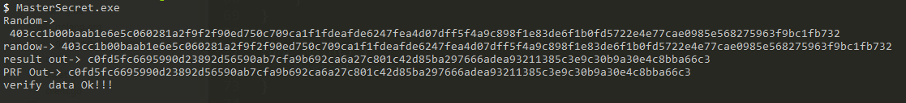

## 工作秘钥的计算

1、标准文档中的描述

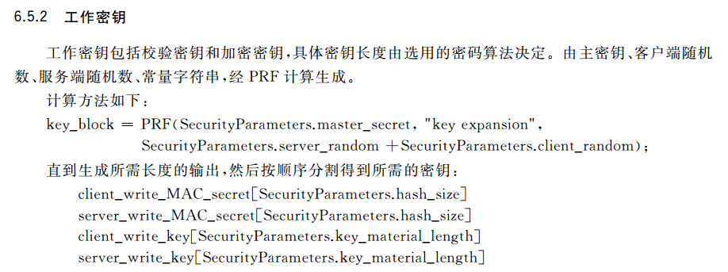

2、补充相关信息

```
client_write_Mac_Key:=32字节
server_write_Mac_Key:=32字节
client_write_Key:=16字节
server_write_Key:=16字节
备注：至于工作的加密的密钥为何是16个字节，这是由于sm4加密是16字节位的
```

样例日志：

```
keysFromMasterSecret clientMAC =ba27277b08b1938710f5dd0b9eae21b22ed6752c220948126aeb164136c72bff
keysFromMasterSecret serverMAC =1a12cf6503a000137f3eed37eb4265158ed3d196efab186bae5509fbbfb75247
keysFromMasterSecret clientKey =19bbb2ff690bc9b5760b99fe4f176a41
keysFromMasterSecret serverKey =ef6c5728fd9a01d0abf2e350081acc50
keysFromMasterSecret clientIV =86db027b8f4dbbb8dc9b8511b4251572
keysFromMasterSecret serverIV =68d7f7210c5c49afebe6a942af9e26dd
```

3、代码实现 去参考githuh.com/piligo/gmssl 等相关库

```
这种计算完全取决于PRF的计算。前面已经实现过了，只是这里长度不一样而已里。结果的长度应该为：32+32+16+16=96个字节
```

