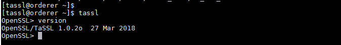
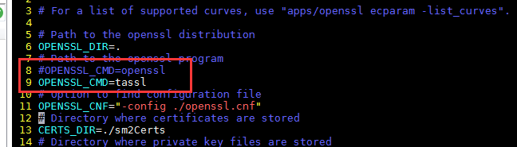
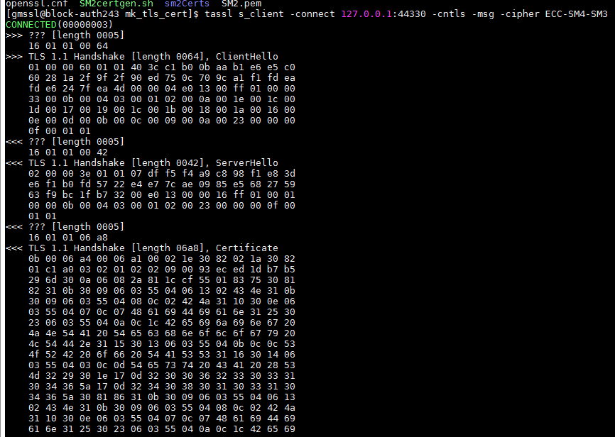

# 国密SSL GO库环境准备-TASSL

## 前言

```
1、如果要开发国密的SSL库，必须要现有可验证的环境。虽然有一些服务说是提供国密的ssl服务端。但是调试并不方便。另外，目前国密的SSL开源的标准说明并不是很清晰，有些地方还是有歧义。
2、目前国密的ssl开源的只有两个库，都是C语言的，都是在openssl上面集成的，gmssl 和tassl。gmssl的文档并不是很清晰，搭建环境走了很弯路。tassl文档相对好一点。这两个库对于国密标准的实现上面还是有一点点差异。
3、综合考虑还是使用TASSL国密库作为调试的环境。
4、另外TASSL的脚本也多一些。
```

```
1、GMSSL -> https://github.com/guanzhi/GmSSL 
2、TASSL -> https://github.com/jntass/TASSL (1.0.2o 本次调试环境使用这个版本，因为集成到openssl中可以清楚的看到交互过程)
3、TASSL -> https://github.com/jntass/TASSL-1.1.1b/releases (tassl-1.1.1b_v1.3)
```

## TASSL环境的搭建

1、编译以及安装（安装在普通用户，避免影响系统原有的）

```
tar zxvfz TASSL-master.V1.0.2o.zip
cd TASSL-master
chmod u+x ./config
./config --prefix=/home/gmssl/bin/tassl
make
make install
cp -fr Tassl_demo/ ~/bin/tassl/    ---复制国密证书测试
cd $HOME/bin/tassl/bin/
ln -s openssl  tassl   --做个软连接
```

备注：普通用户安装

```
Makefile文件注释掉 install_docs 如下
#install: all install_docs install_sw
install: all install_sw
```


2、设置环境变量 .bash_profile

```
export PATH=$PATH:$HOME/bin/tassl/bin
export LD_LIBRARY_PATH=$HOME/bin/tassl/lib:$LD_LIBRARY_PATH
```


3、版本校验



3、生成测试使用的证书

```
cd ~/bin/tassl/Tassl_demo/mk_tls_cert
chmod u+x SM2certgen.sh
vi SM2certgen.sh -->调整一下OPENSSL_CMD=tassl （将默认命令修改为tassl即使用我们自有的）
#生成相关证书
./SM2certgen.sh
```




## TASSL国密测试

1、启动服务端

```
cd $HOME/bin/tassl/tassl_demo
tassl s_server -accept 44330 -CAfile sm2Certs/CA.pem -cert sm2Certs/SS.pem -enc_cert sm2Certs/SE.pem -msg
```


2、启动测试端：

```
tassl s_client -connect 127.0.0.1:44330 -cntls -msg -cipher ECC-SM4-SM3
```

